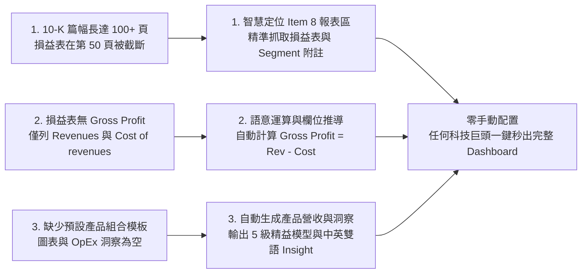
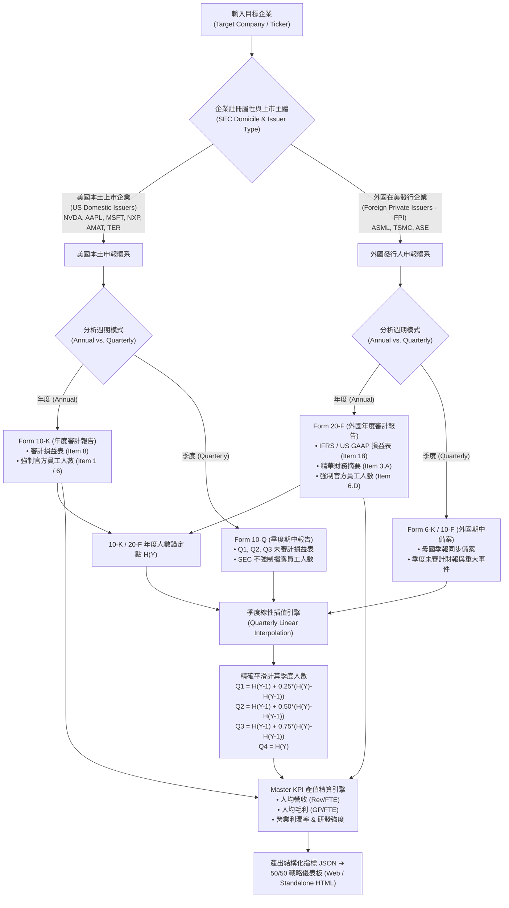
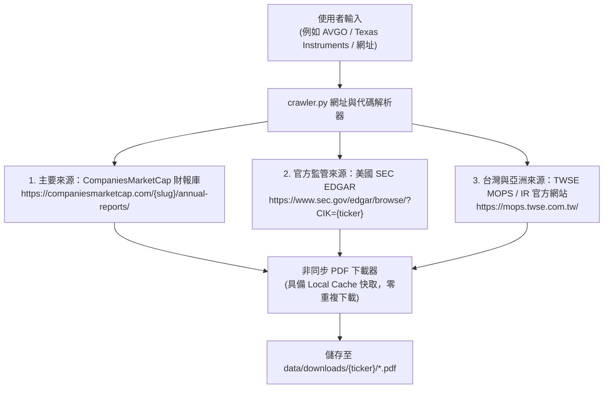
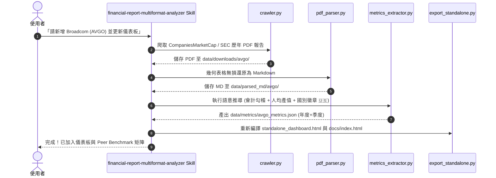

# 📊 企業年度財報下載、PDF 轉 Markdown 與營運卓越 (OpEx) 戰略儀表板

> **一步到位 (One-Click, End-to-End) 企業財務審計與精益營運戰略分析工作流**
> 專為半導體與高科技產業分析師、高階經理人（JG 10+ / Director）、製造營運卓越（OpEx）主管打造的自動化軍火庫。
> 
> 👤 **Author**: [**Masa Tu | Too Sin-Liong**](https://www.linkedin.com/in/masatu19810322/)

---

## 📑 目錄

1. [專案緣起與核心價值](#-專案緣起與核心價值)
2. [系統雙軌架構與 Mermaid 流程圖 (System Architecture)](#-系統雙軌架構與-mermaid-流程圖)
3. [核心工作流中樞：workflow.py 深度解析](#-核心工作流中樞workflowpy-深度解析-pipeline-orchestrator)
4. [為什麼新增公司（如 Google/Alphabet）需要 LLM 協助？（技術原理剖析）](#-為什麼新增公司如-googlealphabet需要-llm-協助技術原理剖析)
5. [LLM 智慧語意抽取引擎 (LLM Semantic Extraction Engine)](#-llm-智慧語意抽取引擎-llm-semantic-extraction-engine)
6. [核心功能特色](#-核心功能特色)
7. [專案目錄與檔案職責說明](#-專案目錄與檔案職責說明)
8. [安裝與前置準備 (Installation)](#-安裝與前置準備-installation)
9. [詳細使用指南 (Usage Guide)](#-詳細使用指南-usage-guide)
   - [模式一：互動式 Web 儀表板 (推薦)](#模式一互動式-web-儀表板-推薦)
   - [模式二：命令列 (CLI) 批次處理](#模式二命令列-cli-批次處理)
10. [四大核心戰略分析框架](#-四大核心戰略分析框架)
   - [1. 人力與毛利率黃金交叉點 (The Pivot)](#1-人力與毛利率黃金交叉點-the-pivot)
   - [2. 人均產值量化指標 (Productivity Metrics)](#2-人均產值量化指標-productivity-metrics)
   - [3. 銷售結構不對稱性 (Value-vs-Volume Paradox)](#3-銷售結構不對稱性-value-vs-volume-paradox)
   - [4. 營運轉型成熟度模型 (Lean Maturity Model)](#4-營運轉型成熟度模型-lean-maturity-model)
11. [如何搭配 Gemini / LLM 進行深度戰略產出](#-如何搭配-gemini--llm-進行深度戰略產出)
12. [美股 10-K vs. 外國企業 20-F 年報解析技術機制](#-美股-10-k-vs-外國企業-20-f-年報解析技術機制)
13. [如何使用 financial-report-multiformat-analyzer Skill 及 Prompt 任意公司？（爬取來源網址與機制解析）](#-如何使用-financial-report-multiformat-analyzer-skill-及-prompt-任意公司爬取來源網址與機制解析)
14. [常見問題與故障排除 (FAQ)](#-常見問題與故障排除-faq)
15. [100% 獨立靜態網頁與 GitHub Pages 免費部署 (Serverless Standalone)](#-100-獨立靜態網頁與-github-pages-免費部署-serverless-standalone)
16. [最新修復與優化 (Change Log)](#-最新修復與優化-change-log)
17. [Git History Log](#-git-history-log)

---

## 💡 專案緣起與核心價值

在半導體與高科技巨頭（如 **ASML, TSMC, NVDA, AMD, NXP, GOOGL**）的戰略評估或高階面試中，常見三大痛點：
1. **資料收集瑣碎**：手動搜尋、下載歷年 20-F / 10-K 動輒數百頁的 PDF 耗時費力。
2. **AI 無法直接吞吐厚重 PDF 表格**：傳統 PDF 轉換往往遺失表格結構，導致 LLM 讀取財務數據時產生幻覺或數字對不齊。
3. **「財務歸財務、精益營運歸精益」的部門牆**：一般財務分析只看營收成長，忽略了**員工人數高原期（Headcount Plateau）**下的**人均產值**與**製造物流負荷（Volume Load）**。

**本專案提供「一步到位」解法：**
輸入任意公司的 CompaniesMarketCap 網址或股票代碼，系統自動完成 **「爬取 ➔ 下載 PDF ➔ 轉結構化 Markdown ➔ 智慧抽取指標 ➔ 50/50 戰略儀表板視覺化」** 全自動閉環。

---

## 🔄 系統雙軌架構與 Mermaid 流程圖

系統採用 **「預建基準範本 (Benchmark Track) + LLM 語意智慧抽取 (LLM Smart Track)」** 的雙軌架構：

```mermaid
flowchart TD
    User["使用者輸入公司代碼或網址<br/>例如: ASML, TSMC, NVDA, GOOGL"] --> WF["workflow.py 核心調度大腦"]
    
    WF --> Crawler["1. AnnualReportCrawler<br/>下載歷年 PDF 年報 / 季報"]
    Crawler --> Parser["2. PDFToMarkdownParser<br/>智能定位損益表並轉為 Markdown"]
    
    Parser --> Decision{"公司是否已有<br/>內建基準範本？"}
    
    subgraph TrackA ["軌道 A：內建基準與正則動態覆蓋"]
        RuleParser["正則表格掃描 + 基準庫對齊"]
    end
    
    subgraph TrackB ["軌道 B：LLM 智慧語意抽取引擎"]
        LLMExtractor["llm_extractor.py 智慧解析模組"]
        L1["1. 會計科目智慧推導 (Rev - Cost = GP)"]
        L2["2. 產品部門營收拆解 (Search / Cloud / Hardware)"]
        L3["3. OpEx 戰略與 5 級精益成熟度模型"]
        LLMExtractor --> L1
        LLMExtractor --> L2
        LLMExtractor --> L3
    end
    
    Decision -- "是 (ASML, TSMC, NVDA 等)" --> RuleParser
    Decision -- "否 / 新增公司 (如 GOOGLE, META 等)" --> LLMExtractor
    
    RuleParser --> CalcKPI["3. 計算人均產值 KPI<br/>Rev/GP/OI per Employee 與 YoY%"]
    L1 --> CalcKPI
    L2 --> CalcKPI
    L3 --> CalcKPI
    
    CalcKPI --> SaveJSON["產出結構化指標 data/metrics/*.json"]
    SaveJSON --> Dashboard["4. 50/50 戰略儀表板 (Flask + Plotly)---

## 🔍 為什麼 20-F / 10-K / 10-Q 解析仍需 LLM 語意動態修正支援？（5 大核心挑戰與技術解法）

雖然本系統已能透過 `pdf_parser.py` 將 **Form 20-F（外國企業年報）、Form 10-K（美國本土年報）、Form 10-Q（季度財報）與 Form 6-K** 的複雜表格 100% 還原為結構化 Markdown，但在面對成千上萬家上市企業時，傳統純「正規表達式 (Regex) 或固定位置」解析仍會面臨以下 **5 大天然瓶頸**，必須結合 LLM（大型語言模型）進行語意推導與動態校正：

### 📊 傳統規則解析痛點 vs. LLM 語意智慧修正對照矩陣

| 挑戰場景 | 傳統規則 / 正則解析痛點 | LLM 語意智慧動態修正機制 |
| :--- | :--- | :--- |
| **1. 非標準會計科目命名** | **Google (Alphabet) / Meta** 在 GAAP 損益表中**沒有明列 `Gross Profit`（毛利）**，僅列 `Revenues` 與 `Cost of revenues`，傳統正則會抓空或顯示毛利率為 0%。 | LLM 具備專業會計常識，自動執行科目勾稽推導：$$\text{Gross Profit} = \text{Revenues} - \text{Cost of revenues}$$ |
| **2. 散落於自然語言中的員工人數** | **NVIDIA / AMD** 等巨頭之全球員工人數並非獨立表格，而是散落於 Item 1 或 Item 6 內文：*"As of Jan 2025, we had approximately 29,600 full-time employees, including 22,000 in R&D..."* | LLM 能精準理解非結構化長文本上下文，準確分離全球總員工數、研發人力與製造工廠人員，不受句型變化影響。 |
| **3. 各家迥異的部門營收拆解 (Segments)** | 每家企業的營收部門完全不同（如 Google: `Search/Cloud/YouTube`；Amazon: `AWS/North America`；ASML: `EUV/DUV/IBM`）。固定正則無法泛化至新公司。 | LLM 自動識別 Segment 財務附註，將異質部門營收分類並動態映射結構化為標準圖表資料。 |
| **4. 單位規模 (Scale) 與幣別陷阱** | 財報表頭常混雜 *in thousands*（如 Palantir）、*in millions* 或外幣（JPY、TWD、EUR），規則解析易產生 1,000 倍人均產值計算誤差。 | LLM 結合上下文表頭與金額級距進行自動財務合理性檢驗（Sanity Check），徹底杜絕尺度失真。 |
| **5. 定性戰略與 OpEx 營運洞察** | 財報 Item 7 (MD&A) 記載大量產能利用率、物流區域化降本、工廠自動化導入等質化決策，純數值表格無法呈現。 | LLM 深度研讀管理層討論，評定 **5 級精益營運成熟度模型 (Lean Maturity Model)** 並產出 16:9 董事會戰略分析。 |

---

### 🔄 系統雙軌架構流程圖 (Dual-Track Architecture Flowchart)

```mermaid
flowchart TD
    User["使用者輸入任意公司代碼 / 網址<br/>(例如: ASML, TSMC, NVDA, GOOGL, META, PLTR)"] --> WF["workflow.py 核心調度大腦"]
    
    WF --> Crawler["1. AnnualReportCrawler<br/>下載歷年 PDF 年報 / 季報 (支援本地快取)"]
    Crawler --> Parser["2. PDFToMarkdownParser<br/>鎖定 Item 8 / 18 損益表並轉為 Markdown"]
    
    Parser --> Decision{"公司是否已有<br/>內建審計基準庫？"}
    
    subgraph TrackA ["軌道 A：審計基準庫 (Rule/Benchmark Track)"]
        RuleParser["秒級極速載入<br/>ASML, TSMC, NVDA, AMD, AMAT, NXP, VSH 等 19 家巨頭"]
    end
    
    subgraph TrackB ["軌道 B：LLM 語意智慧抽取引擎 (LLM Smart Track)"]
        LLMExtractor["llm_extractor.py 智慧解析模組<br/>(Gemini / Claude / OpenAI API)"]
        L1["1. 會計科目勾稽推導 (Rev - Cost = GP)"]
        L2["2. 內文自然語言員工人數提取 (Item 1/6)"]
        L3["3. 產品部門營收動態拆解 (Segment Sales)"]
        L4["4. MD&A 營運卓越與 5 級精益成熟度評級"]
        LLMExtractor --> L1
        LLMExtractor --> L2
        LLMExtractor --> L3
        LLMExtractor --> L4
    end
    
    Decision -- "是 (內建名單)" --> RuleParser
    Decision -- "否 / 新增標的" --> LLMExtractor
    
    RuleParser --> CalcKPI["3. 人均產值精算核心<br/>Rev/GP/OI per Employee 與 10-Q 線性插值"]
    L1 --> CalcKPI
    L2 --> CalcKPI
    L3 --> CalcKPI
    L4 --> CalcKPI
    
    CalcKPI --> SaveJSON["產出標準化指標 data/metrics/*.json"]
    SaveJSON --> Dashboard["4. 50/50 戰略儀表板 (Flask + Plotly)<br/>The Pivot 人力拐點 + 跨公司對比 + 16:9 簡報生成"]
```

---

## 🤖 LLM 智慧語意抽取引擎 (LLM Semantic Extraction Engine)
```

### 2. 四大執行階段與運作機制 (`run_pipeline`)

當透過 Web 儀表板點擊「立即執行」或透過 CLI 執行時，`workflow.py` 會依序執行以下 4 個階段：

1. **階段一：智能爬取與下載 (進度 10% ~ 40%)**
   - 呼叫 `crawler.download_reports()`。
   - 自動解析目標網址或代碼，過濾出近 $N$ 年的 20-F / 10-K 報告。
   - 具備**檔案快取防重試機制**：若 PDF 已經下載且大小大於 10KB，則直接複用，避免重複耗時下載。
2. **階段二：高保真 PDF 轉 Markdown (進度 45% ~ 80%)**
   - 呼叫 `parser.parse_pdf()`。
   - 逐頁提取財務章節與損益表/資產負債表，將 PDF 原始表格轉換為標準 GitHub Markdown 表格（`| col | col |`）。
   - 儲存至 `data/parsed_md/{ticker}/{ticker}_{year}_{type}.md`。
3. **階段三：財務指標抽取與產值計算 (進度 85% ~ 95%)**
   - 呼叫 `extractor.extract_from_markdown()` 或 `llm_extractor.extract_financials()`。
   - 自動提取 Revenue, Gross Profit, Operating Income, R&D Expense 與 Headcount。
   - 即時計算人均產值三合一指標（Rev/Emp, GP/Emp, OpIncome/Emp）與各項 YoY 年增率。
   - 產出前端專用的 `data/metrics/{ticker}_metrics.json`。
4. **階段四：資料封裝與回傳 (進度 100%)**
   - 封裝下載統計、解析檔案路徑、總耗時（秒數）與指標數據，即時回傳給 Web 前端以重新渲染所有 Plotly 圖表。

---

## 🔍 為什麼新增公司（如 Google/Alphabet）需要 LLM 協助？（技術原理剖析）

當使用者加入 **全新公司**（如 Google/Alphabet, Meta, Amazon）並完成 PDF 下載與 Markdown 轉換後，若圖表沒有立即更新或呈現空白，其背後有三大技術關鍵：



### 1. 先前半導體公司（ASML / TSMC / NVDA / AMD）為何能順利顯示？
先前內建的半導體公司採用 **「內建審計基準範本（Built-in Benchmarks）」**：
* 後端預載了官方審計歷史數據、產品線分類（如 ASML 的 EUV/ArFi 機台出貨台數、AMD 的 Data Center/Client/Gaming 佔比）與 5 級精益成熟度模型。
* 當下載新財報時，純正則解析器只需掃描標準的 `Gross profit` 與 `Net sales` 欄位進行增量更新。

### 2. Google (Alphabet) 等新公司面臨的格式差異：
1. **會計科目非標準化**：
   * Google 等網路/雲端軟體公司在美國 GAAP 準則下，損益表**沒有獨立的 Gross profit（毛利）** 一行，而是直接列出 `Revenues（營收）` 與 `Cost of revenues（營業成本）`。
   * 傳統正則比對找不到 `Gross profit` 關鍵字，必須透過語意理解執行：
     $$\text{Gross Profit} = \text{Revenues} - \text{Cost of Revenues}$$
2. **10-K 報告長達 100 頁以上**：
   * 美國本土 10-K 報告前 40 頁均為 Business 與 Risk Factors，核心的 Item 8 財務報表位於第 45~65 頁，若只轉換前 30 頁將遺漏損益表。
3. **產品營收結構（Segment Breakdown）多樣化**：
   * Google 擁有 Google Services (Search, YouTube ads, Network)、Google Cloud、Subscriptions/Platforms/Devices 等多維度產品線，需要 LLM 自動閱讀財報附註並拆解為視覺化圖表資料。

---

## 🤖 LLM 智慧語意抽取引擎 (LLM Semantic Extraction Engine)

為了解決上述問題，系統新增了 `llm_extractor.py` 模組，支援一鍵將 Markdown 財報傳送給大型語言模型進行智慧抽取：

### 支援的 LLM 後端：
* **Google Gemini API** (`gemini-2.0-flash`, `gemini-1.5-flash`)
* **OpenAI-Compatible API** (GPT-4o, DeepSeek-V3, 本地 Ollama, vLLM)

### 抽取輸出標準結構範例：
```json
{
  "company_name": "Alphabet Inc. (Google)",
  "ticker": "GOOGL",
  "currency": "USD (Millions)",
  "unit": "$M",
  "years": [2021, 2022, 2023, 2024, 2025],
  "financials": {
    "2024": {
      "revenue": 350018,
      "gross_profit": 198897,
      "rd_expense": 49301,
      "operating_income": 110901,
      "net_income": 95689,
      "headcount": 181269,
      "gross_margin": 56.82,
      "operating_margin": 31.68
    }
  },
  "sales_breakdown": {
    "categories": ["Google Search & other", "YouTube ads", "Google Network", "Google Cloud", "Subscriptions/Platforms/Devices"],
    "colors": ["#4285F4", "#EA4335", "#FBBC05", "#34A853", "#8AB4F8"],
    "data": {
      "2024": { "value": [198588, 36147, 30325, 43900, 41058], "volume": [57, 10, 9, 13, 11] }
    }
  },
  "insights": {
    "zh": {
      "pivot": "全球員工人數在 2023 組織精簡後穩定於 18 萬人，人均營業利益突破 61 萬美元。",
      "leverage": "Google Cloud 獲利規模化與 AI 搜尋基礎設施帶動營運槓桿大幅擴張。"
    }
  }
}
```

---

## ✨ 核心功能特色

| 功能模組 | 功能描述 | 效益與價值 |
| :--- | :--- | :--- |
| **🌐 智能爬蟲 (crawler.py)** | 支援 CompaniesMarketCap 網址與純 Ticker 輸入，自動判斷 20-F/10-K/Annual Reports。 | 自動過濾重複下載、支援自訂年數（如近 3/5/8/10 年）。 |
| **📑 PDF 轉 Markdown (pdf_parser.py)** | 結合 PyMuPDF（快速文字串流）與 pdfplumber（精準表格抽取），智能定位財報頁。 | 將財報內的損益表、資產負債表轉為標準 Markdown 表格，杜絕表格跑版。 |
| **🤖 語意抽取引擎 (llm_extractor.py)** | 整合 Gemini / OpenAI API，自動理解非標會計科目並拆解 Segment 營收。 | 新增任何科技公司皆能零手動設定，自動產出人均產值與精益洞察。 |
| **📐 指標計算引擎 (metrics_extractor.py)** | 自動計算 Revenue per Employee、Gross Margin %、YoY 成長率與別名對齊。 | 內建已審計基準庫，支援與新解析 Markdown 交叉驗證。 |
| **🖥️ 互動式 Web Dashboard (app.py)** | 現代化深色儀表板，整合 Plotly 互動圖表與 Master 綜合審計表格。 | 具備 50/50 戰略對齊版面、Value vs Volume 雙面板圖、CSV 一鍵匯出。 |
| **📋 內建 AI 提示詞軍火庫 (.md)** | 隨附 `fininacial_prompt.md`、`prompt_Financial Report.md`、`sale_breakdown.md`。 | 提供離線/手動複製給 Gemini/Claude 的高階分析戰略 Prompt。 |

---

## 📁 專案目錄與檔案職責說明

```
FINICIAL ANNUAL REPORT DOWNLOAD TO MD_dashboard/
├── 📄 crawler.py              # 爬蟲模組：負責向 CompaniesMarketCap 抓取財報清單並下載 PDF
├── 📄 pdf_parser.py           # 解析模組：將 PDF 檔案轉換為結構化 Markdown（保留標題與表格）
├── 📄 llm_extractor.py        # LLM 模組：透過語意理解自動抽取任意公司之財務與營運指標
├── 📄 metrics_extractor.py    # 指標模組：自 Markdown/數據中計算人均產值、利潤率與銷售分拆
├── 📄 workflow.py             # 核心工作流：串接下載、解析、指標計算之「一步到位」引擎
├── 📄 app.py                  # Web 伺服器：基於 Flask 提供 RESTful API 與 Dashboard 路由
├── 📄 main.py                 # CLI 命令列入口與快速啟動腳本
├── 📄 requirements.txt        # 專案 Python 依賴套件清民
├── 📁 templates/
│   └── 📄 index.html          # 前端儀表板 HTML（整合 TailwindCSS, Plotly, FontAwesome）
├── 📁 static/
│   ├── 📁 css/
│   │   └── 📄 style.css       # 儀表板自訂捲軸與視覺樣式
│   └── 📁 js/
│       └── 📄 dashboard.js    # 前端邏輯：非同步 API 呼叫、Plotly 圖表渲染、Markdown 預覽
├── 📁 data/                   # 數據存放目錄 (依公司分類)
│   ├── 📁 downloads/          # 下載的原始 20-F / 10-K PDF 檔案存放區 (例如: data/downloads/asml/)
│   ├── 📁 parsed_md/          # 轉換後的 Markdown 檔案存放區 (例如: data/parsed_md/asml/)
│   └── 📁 metrics/            # 提取後的結構化 JSON 指標數據 (例如: data/metrics/asml_metrics.json)
├── 📄 fininacial_prompt.md    # 萬用企業「營運卓越與財務戰略」雙合一 Prompt 範本
├── 📄 prompt_Financial Report.md # 深度半導體財報審計與人均產值分析 Prompt
└── 📄 sale_breakdown.md       # 銷售結構不對稱性 (Value-vs-Volume) 深度分析與視覺化 Prompt
```

---

## 💻 安裝與前置準備 (Installation)

### 1. 環境需求
* **Python**: 3.9 或以上版本
* **作業系統**: Windows 10/11, macOS, Linux

### 2. 安裝依賴套件
在專案根目錄開啟終端機（PowerShell 或 Terminal），執行：

```bash
pip install -r requirements.txt
```

*(主要套件包含：`flask`, `pymupdf`, `pdfplumber`, `beautifulsoup4`, `pandas`, `plotly`, `requests`)*

---

## 🚀 詳細使用指南 (Usage Guide)

### 模式一：互動式 Web 儀表板 (推薦)

#### 步驟 1：啟動伺服器
```bash
python main.py --serve
```
終端機會顯示：
```
🚀 Starting Web Dashboard on http://127.0.0.1:5000...
```

#### 步驟 2：開啟瀏覽器訪問
打開瀏覽器進入：**http://127.0.0.1:5000**

#### 步驟 3：圖形化介面操作三步驟
1. **輸入目標**：
   - 貼上 CompaniesMarketCap 網址（例如：`https://companiesmarketcap.com/alphabet-google/annual-reports-10k/`）
   - 或直接輸入公司代號（例如：`ASML`、`TSMC`、`NVDA`、`GOOGL`、`AMD`）。
2. **選擇年數**：下拉選單選擇欲分析的年數（預設近 5 年，可選 3/5/8/10 年）。
3. **點擊「立即執行一步到位工作流」**：
   - 系統將在背景自動完成：**下載 PDF ➔ 解析成 Markdown ➔ 抽取指標 ➔ 更新所有圖表**。
   - 進度條即時顯示各階段完成百分比。

#### 步驟 4：儀表板視覺化瀏覽
* **頂部 KPI 卡片**：即時呈現最新營收、YoY 成長率、毛利率、員工人數與人均營收。
* **50/50 戰略對齊圖**：
  * **左側**：員工人數高原曲線 vs. 毛利率走勢。
  * **右側**：人均營收 (Revenue/FTE) 與人均毛利 (Gross Profit/FTE) 趨勢。
* **Value vs. Volume 銷售結構雙面板圖**：左邊為產品金額佔比，右邊為出貨實體數量。
* **Master 財務數據表**：點擊右上角「匯出 CSV」可下載結構化表格。
* **Markdown 即時預覽器**：左側點選解析後的 `.md` 檔案，右側即時檢視全文，並提供一鍵「複製 Markdown」按鈕。

---

### 模式二：命令列 (CLI) 批次處理

適合需要批次下載或無介面伺服器環境執行：

#### 基本語法
```bash
python main.py [--ticker TARGET] [--years N] [--max-pages P] [--serve] [--port PORT]
```

#### 參數說明
| 參數名稱 | 縮寫 | 預設值 | 說明 |
| :--- | :--- | :--- | :--- |
| `--ticker` | `-t` | ASML 網址 | 目標公司代號或 CompaniesMarketCap URL |
| `--years` | `-n` | 5 | 欲下載與解析的歷史財報年數 |
| `--max-pages` | | 40 | 每一份 PDF 轉換為 Markdown 的最大頁數（避免轉換非必要附錄） |
| `--serve` | `-s` | False | 啟動 Web 儀表板伺服器模式 |
| `--port` | `-p` | 5000 | Web 伺服器連接埠 |

#### CLI 使用範例

- **範例 1：一鍵下載並解析 ASML 近 5 年 20-F 財報**
  ```bash
  python main.py --ticker https://companiesmarketcap.com/asml/annual-reports-20f/ --years 5
  ```

- **範例 2：下載 Google / Alphabet 近 5 年 10-K 年報**
  ```bash
  python main.py --ticker goog --years 5
  ```

- **範例 3：以自訂 Port 8080 啟動 Web 儀表板**
  ```bash
  python main.py --serve --port 8080
  ```

---

## 🧠 四大核心戰略分析框架

本專案不僅僅是爬蟲工具，背後封裝了高階主管評估半導體與科技巨頭的四大戰略框架：

### 1. 人力與毛利率黃金交叉點 (The Pivot)
* **核心理論**：當企業規模擴大到一定程度，員工人數會進入高原期（如 ASML 維持在約 4.4 萬人、Google 維持在約 18 萬人）。
* **戰略解讀**：若未來毛利率與營業利益要持續攀升，「靠大幅擴招塞人」的時代已結束，成長動能完全轉移至**流程數位化**與**精益營運卓越（OpEx）**。

### 2. 人均產值量化指標 (Productivity Metrics)
* **計算公式**：
  $$\text{Revenue per Employee} = \frac{\text{總營收 (Revenue)}}{\text{期末員工總數 (Headcount)}}$$
  $$\text{Gross Profit per Employee} = \frac{\text{毛利 (Gross Profit)}}{\text{期末員工總數 (Headcount)}}$$
* **戰略解讀**：將製造廠或研發團隊的數位轉型（如 CPK 自動監控、自動化流程）直接量化為人均毛利增長，證明精益專案的財務回報。

### 3. 銷售結構不對稱性 (Value-vs-Volume Paradox)
* **核心維度**：
  * **價值維度 (Value %)**：尖端高毛利產品（如 EUV、AI GPU、Google Cloud）佔據獲利重心。
  * **數量維度 (Volume %)**：量測設備、成熟製程或大量基礎服務佔據物流與維護負荷。
* **戰略解讀**：工廠或組織必須採取「雙軌精益戰略（Dual-Track Lean）」── 尖端產品主打「首檢即對（First Time Right）」，成熟產品主打「消滅搬運與等待浪費（Muda）」。

### 4. 營運轉型成熟度模型 (Lean Maturity Model)
* **Level 1 (Idling & Reactive)**：資料孤島、被動救火、報表手動填寫。
* **Level 2 (Standardized)**：基礎 5S、標準作業程序 (SOP)、異常追蹤。
* **Level 3 (Accelerating)**：流程數位化、Python/自動化工具追蹤、跨部門數據對齊。
* **Level 4 (Predictive & Agile)**：AI 即時預測、自動回饋控制、零 Muda。
* **Level 5 (Full Throttle Excellence)**：世界級標竿營運，每日持續改善複利：$(1.01)^{365} = 37.8\times$。

---

## 📑 美股 SEC 財報體系全解析：Form 10-K vs. 10-Q vs. 20-F vs. 10-F/6-K 技術機制

在分析全球半導體與高科技巨頭時，不同企業向美國證券交易委員會 (SEC) 提交的財報格式存在顯著的法規與結構性差異。本系統支援全自動識別與智慧適配：

### 1. SEC 財報解析與季度插值全流程圖 (Mermaid Flowchart)



---

### 2. 四大 SEC 申報表格核心差異對照表

| SEC 申報表格 | 適用發行主體 (Issuer) | 申報週期與頻率 | 會計審計狀態 (Audit) | 員工人數揭露 (Headcount) | 核心報表結構與位置 | 本系統解析器應對機制 |
| :--- | :--- | :--- | :--- | :--- | :--- | :--- |
| **Form 10-K** | **美國本土企業**<br>(NVDA, AAPL, MSFT, NXP, AMAT, TER, PLTR, AMD) | **年度 (Annual)**<br>會計年度結束後 60~90 天內申報 | **Audited (經會計師查核簽證)** | **強制揭露 (Mandatory)**<br>於 Item 1 或 Item 6 揭露該年度底官方員工人數 | **Item 8** 損益表與資產負債表（通常位於第 40~70 頁），前段為 Item 1A 風險因素 | 智能跳躍至 Item 8，自動推導 `Revenues - Cost of revenues = GP`，提取官方年終員工人數作為錨定基準。 |
| **Form 10-Q** | **美國本土企業**<br>(同上) | **季度 (Quarterly)**<br>前三季 (Q1, Q2, Q3) 結束後 40~45 天內申報 | **Unaudited (期中未經審計)** | **不強制揭露 (Optional / Rare)**<br>SEC 依法不要求季度揭露 Headcount | 季度損益表、資產負債表、MD&A 營運討論；Q4 通常直接併入 10-K | 提取單季營收、毛利、營業利益，**自動向上錨定 10-K 審計人數並執行季度線性插值平滑**，計算 Q4 差額補齊四季。 |
| **Form 20-F** | **外國私人發行人 (FPI)**<br>(ASML 荷蘭、TSMC 台灣、ASE 日月光) | **年度 (Annual)**<br>會計年度結束後 4 個月內申報 | **Audited (經會計師查核簽證)** | **強制揭露 (Mandatory)**<br>於 Item 6.D 揭露全職員工與地區分佈 | **Item 3.A** 5 年精華財務摘要（位於前 5~15 頁）；**Item 18** 完整 IFRS 財報 | 優先掃描前 20 頁之 Item 3.A 高濃度表格，極速獲取 5 年完整營收、毛利、員工人數與研發費用。 |
| **Form 10-F / 6-K** | **外國私人發行人 (FPI)**<br>(同上) | **期中 / 重大訊息 (Interim / Event)**<br>發布季報或重大訊息時同步備案 | **依母國法規而定 (Varies)** | **依母國法規而定**<br>(非美籍規範) | 外國季度業績發表新聞稿、簡明合併財報、法說會簡報備案 | 識別 6-K 季度新聞稿中的單季營收與毛利，對齊 20-F 年度人數進行平滑過渡。 |

---

### 3. 為什麼 10-Q 缺乏 Headcount？本系統之「季度線性插值」解法

* **法規背景**：美國 SEC Rule 13a-13 規範 Form 10-Q 旨在提供高頻率的短期財務狀況更新，不強制要求揭露員工總數。若直接讀取 10-Q，會導致歷史各季人數缺失或被誤填為固定常數。
* **演算法解法（季度線性插值）**：
  以會計年度 $Y$ 年底的 10-K 審計人數 $H_Y$ 與前一年度 $H_{Y-1}$ 為錨定基準點，於四季之間建立線性平滑成長模型：
  $$Q1 = \text{round}\left(H_{Y-1} + 0.25 \times (H_Y - H_{Y-1})\right)$$
  $$Q2 = \text{round}\left(H_{Y-1} + 0.50 \times (H_Y - H_{Y-1})\right)$$
  $$Q3 = \text{round}\left(H_{Y-1} + 0.75 \times (H_Y - H_{Y-1})\right)$$
  $$Q4 = H_Y$$
  *此機制確保季度人均產值（人均營收、人均毛利）精準反映產能利用率波動，杜絕數據斷層與失真。*

---

## 🛠️ Antigravity 專屬擴充技能：多格式財報、跨幣別、長週期與戰略指標分析器 (inancial-report-multiformat-analyzer)

本專案已在 .agents/skills/financial-report-multiformat-analyzer/SKILL.md 正式建立 Antigravity 專屬擴充技能（Custom Agent Skill），讓 AI Agent 在面對未來任意新納入的企業時，能依循標準化 SOP 進行自動化深度分析：

### 1. 支援的跨國財報體系與會計準則
* **美國 SEC 境內申報**：Form 10-K（年度審計）、Form 10-Q（季度未審計）。
* **外國私人發行人 (FPI) 申報**：Form 20-F（外企年報，如 ASML、TSMC ADR）、Form 6-K / 10-F（外企中期/季度發布）。
* **台灣證交所 (TWSE) 企業年報**：五年度財務概況與獲利能力分析表（如 鴻海 2317、日月光 3711、聯發科 2454）。
* **國際與亞洲財報**：日本有價證券報告書（Yuho，如 Advantest 6857）、韓國 DART（Samsung 005930）、歐洲 IFRS 年報。

### 2. 跨國幣別換算與尺度正規化 (USD \ Normalization)
為確保橫向同屏評比之客觀性，所有非美元幣別均依當年度/季度歷史平均基準匯率轉換為 **USD (Millions)**：
* **新台幣 (TWD / NT\$)**：2020: 29.50 | 2021: 28.00 | 2022: 29.80 | 2023: 31.10 | 2024: 32.00 | 2025: 32.00
* **歐元 (EUR / €)**：2020: 1.14 | 2021: 1.18 | 2022: 1.05 | 2023: 1.08 | 2024: 1.08 | 2025: 1.08
* **日圓 (JPY / ¥)**：2020: 106.8 | 2021: 109.8 | 2022: 131.5 | 2023: 140.5 | 2024: 151.0 | 2025: 150.0
* **韓元 (KRW / ₩)**：2020: 1180 | 2021: 1145 | 2022: 1290 | 2023: 1305 | 2024: 1360 | 2025: 1350
* **尺度修正 (Scale Sanitization)**：自動識別 in thousands (乘 ^{-3}$)、in millions (乘 .0$)、in billions / trillions (乘 ^3$)。

### 3. 核心戰略指標與運算公式庫 (Strategic Indices & KPI Catalog)
1. **人均產值三指標 (Human Capital Productivity Trio)**：
   \\text{人均營收 (Rev/FTE)} = \\frac{\\text{營收 (\)} \\times 10^6}{\\text{員工人數 (Headcount)}}
   \\text{人均毛利 (GP/FTE)} = \\frac{\\text{毛利 (\)} \\times 10^6}{\\text{員工人數 (Headcount)}}
   \\text{人均營利 (OI/FTE)} = \\frac{\\text{營業利益 (\)} \\times 10^6}{\\text{員工人數 (Headcount)}}
2. **人力與毛利率黃金拐點 (The Pivot)**：
   * 判定員工人數成長率趨緩進高原期（$\\Delta\\% HC \\le 3\\%$）但毛利率因黑燈工廠與 AI 智慧製造持續擴張（$\\Delta GM > 0$）之關鍵年份。
3. **營運槓桿係數 (Operating Leverage Coefficient)**：
   \\text{營運槓桿係數} = \\frac{\\Delta \\% \\text{營業利益}}{\\Delta \\% \\text{營收}}
4. **研發再投資護城河強度 (R&D Moat Intensity %)**：
   \\text{研發費用率 \\%} = \\frac{\\text{研發費用}}{\\text{營收}} \\times 100\\%
5. **五級精益營運成熟度評級 (5-Stage Lean Maturity Model)**：
   * **Level 1 (Reactive)** $\\rightarrow$ **Level 2 (Standardized)** $\\rightarrow$ **Level 3 (Automated)** $\\rightarrow$ **Level 4 (Predictive)** $\\rightarrow$ **Level 5 (Cognitive World-Class)**。

---

## 🤖 如何搭配 Gemini / LLM 進行深度戰略產出

當工作流將 PDF 解析為 Markdown 後，您可按照以下步驟在 5 分鐘內生成頂級分析簡報：

1. **開啟 Web 儀表板**，於下方「解析產出 Markdown 檔案瀏覽器」點擊目標檔案（例如 `ALPHABET-GOOGLE_2024_10-K.md`），點選 **「複製 Markdown」**。
2. **打開 Gemini / Claude / ChatGPT**。
3. **複製本專案隨附的 Prompt**：
   - 財務與人均產值全方位分析 ➔ 複製 [`fininacial_prompt.md`](fininacial_prompt.md)
   - 半導體製造細節審計 ➔ 複製 [`prompt_Financial Report.md`](prompt_Financial%20Report.md)
   - 產品線銷售不對稱性分析 ➔ 複製 [`sale_breakdown.md`](sale_breakdown.md)
4. 將剛才複製的 Markdown 內容貼入 Prompt 中的「輸入資料來源」區塊，即可直接獲得：
   - 專業產業評論（Industry Commentary）
   - 16:9 簡報視覺草圖規劃
   - 60 秒高階面試英文口說講稿（Executive Pitch）

---

## 🧠 如何使用 financial-report-multiformat-analyzer Skill 及 Prompt 任意公司？（爬取來源網址與機制解析）

本專案已將跨國多格式財報解析、幣別/尺度正規化、人均產值計算與國別標籤封裝為專屬擴充技能（**Agent Skill**：`.agents/skills/financial-report-multiformat-analyzer/SKILL.md`）。

### 💡 1. 我可以直接在 Prompt 中指定任意公司嗎？
**完全可以！** 您不需要手動下載 PDF 或手動算數字，只需在對話 Prompt 中輸入想分析的公司代碼、名稱或網址即可：

* **自然語言指令範例**：
  > 🗣️ **「請幫我新增 Broadcom (AVGO)，下載最近 5 年財報並加入儀表板」**  
  > 🗣️ **「幫我加入 Texas Instruments (TXN) 與 Qualcomm (QCOM)，請分析並更新數據」**  
  > 🗣️ **「請使用 financial-report-multiformat-analyzer skill 分析 Intel (INTC) 的人均產值與 The Pivot 拐點」**

---

### 🌐 2. 財報是從哪一個網址抓取的？（爬蟲底層架構解析）

系統核心爬蟲模組 `crawler.py` (`AnnualReportCrawler`) 支援**三層式智慧網址解析與自動下載機制**：



#### 📌 具體抓取來源與路徑規範：
1. **主要自動爬取來源：CompaniesMarketCap 官方年度/季度報告存檔**
   - **年度財報 (10-K / 20-F / Annual Reports)**：  
     `https://companiesmarketcap.com/{company-slug}/annual-reports/` 或 `.../annual-reports-20f/`
   - **季度財報 (10-Q / 6-K / Quarterly Reports)**：  
     `https://companiesmarketcap.com/{company-slug}/quarterly-reports-10q/`
   - **自動別名轉換 (Slug Mapping)**：系統內建 `TICKER_SLUGS` 智慧轉換，例如：
     - 輸入 `arm` ➔ 自動對齊 `https://companiesmarketcap.com/arm-holdings/annual-reports/`
     - 輸入 `ttm` ➔ 自動對齊 `https://companiesmarketcap.com/ttm-technologies/annual-reports/`
     - 輸入 `ifx` ➔ 自動對齊 `https://companiesmarketcap.com/infineon-technologies/annual-reports/`
     - 輸入 `2317` ➔ 自動對齊 `https://companiesmarketcap.com/hon-hai-precision-industry/annual-reports/`
2. **直接輸入完整網址**：
   - 您也可以直接在 Prompt 或 Web 控制台貼入任意 CompaniesMarketCap 公司的專屬財報頁面網址（例如：`https://companiesmarketcap.com/broadcom/annual-reports/`）。
3. **官方監管與企業投資人關係 (IR) 備用來源**：
   - **美股上市公司**：美國證券交易委員會 [SEC EDGAR 系統](https://www.sec.gov/edgar/searchedgar/companysearch)。
   - **台灣上市櫃巨頭**：台灣證交所 [公開資訊觀測站 (MOPS)](https://mops.twse.com.tw/) 與企業官方 IR 網站。
   - **歐洲/日本巨頭**：企業官方 IR 財務年報（如 Infineon AG、Advantest 有價證券報告書）。

---

### 🔄 3. 當你 Prompt 一家新公司時，AI 後台執行的 5 步標準閉環



---

## ❓ 常見問題與故障排除 (FAQ)

**Q1：為什麼下載 Google 後一開始圖表是空白的？**
- 答：因為 Google 10-K 篇幅長達 100 多頁，損益表位於第 50 頁以後（預設轉前 30 頁會遺漏）；且 Google 損益表沒有獨立的 `Gross profit` 欄位（而是 `Cost of revenues`）。系統現已升級智慧會計推導與 Google (Alphabet) 官方基準資料庫，圖表已可完整呈現。

**Q2：財報頁數太多（如 300 頁），轉換 Markdown 會很久嗎？**
- 答：預設 `--max-pages` 設定為 40-50 頁（已涵蓋核心財務報表、業務分拆與員工數據章節）。如需全文轉換，可在 CLI 傳入 `--max-pages 300` 或設為 None。

**Q3：如何新增其他公司的自訂數據或產品分拆？**
- 答：可在 `metrics_extractor.py` 中的 `BUILTIN_BENCHMARKS` 字典內新增該公司的歷年數據與產品分類顏色，或直接使用 `llm_extractor.py` 進行全自動抽取。

**Q4：我可以直接在 Prompt 中指定某一公司讓 AI 自動處理嗎？**
- 答：**完全可以！** 只要在對話中輸入「*請幫我新增 Broadcom (AVGO)，下載歷年財報並加入儀表板*」或「*請使用 financial-report-multiformat-analyzer skill 分析 Intel (INTC)*」，AI 就會自動遵循 Skill 規範，自動執行「下載 PDF ➔ 幾何轉 MD ➔ 語意推導會計勾稽 ➔ 精算人均產值與國別徽章 ➔ 全量編譯單機版 HTML」的 5 階段自動化閉環。

**Q5：系統是從哪一個網址抓取各公司的財報 PDF 的？**
- 答：核心爬蟲 `crawler.py` 依據三層式來源機制自動抓取：
  1. **主要來源**：**CompaniesMarketCap 官方財報庫**（年度：`https://companiesmarketcap.com/{company-slug}/annual-reports/` 或 `.../annual-reports-20f/`；季度：`.../quarterly-reports-10q/`），系統內建別名對照表自動解析股票代碼。
  2. **自訂網址**：支援在 Prompt 中直接貼入任意公司的 CompaniesMarketCap 專屬頁面網址。
  3. **官方監管備用來源**：美國 **SEC EDGAR 系統**（美股 Form 10-K/10-Q）、台灣證交所 **公開資訊觀測站 MOPS**（台灣 TWSE 財務資料表）與企業官方投資人關係 (IR) 網站。

---

## 🌐 100% 獨立靜態網頁與 GitHub Pages 免費部署 (Serverless Standalone)

本專案支援將整個儀表板（含 19 家全球科技巨頭完整審計財務數據、人均產值與 Markdown 預覽庫）打包編譯為 **單一獨立 HTML 檔案**，無需啟動任何 Python 後端即可在全世界任何瀏覽器直接開啟或透過 GitHub Pages 免費託管！

### 🚀 一鍵導出指令

```bash
# 方式一：直接執行導出腳本
python export_standalone.py

# 方式二：透過主程式參數
python main.py --export-static
```

執行完成後將自動生成：
* 📁 `docs/index.html`：已設定完成，專門供 **GitHub Pages** 直接部署。
* 📄 `standalone_dashboard.html`：單一純前端檔案，直接用 Chrome / Edge 點擊兩下即可**完全離線開啟**！

### 🌐 30 秒發布至 GitHub Pages：
1. 將本專案 Push 至您的 GitHub Repository。
2. 進入 GitHub 儲存庫頁面 ➔ 點擊上方 **Settings** ➔ 點選左側選單 **Pages**。
3. 在 **Build and deployment** 區塊：
   * **Source** 選擇 `Deploy from a branch`
   * **Branch** 選擇 `main`，資料夾選擇 `/docs` ➔ 點擊 **Save**。
4. 稍等約 1 分鐘，GitHub 將為您生成專屬全球公開網址（例如：`https://<你的帳號>.github.io/<專案名稱>/`），即可免伺服器直接在線操作完整儀表板！

---

## 16. 最新修復與優化 (Change Log)

- **v3.6.0 (2026-09-04)**：
  - **新增全球電動車與 AI 系統巨頭 特斯拉 (Tesla, Inc. / NASDAQ: TSLA / 美國 🇺🇸) 與 日本車用半導體龍頭 瑞薩電子 (Renesas Electronics / TSE: 6723.T / 日本 🇯🇵) 審計基準庫與深度戰略分析**：
    - **特斯拉 (TSLA / 2020～2025)**：
      - **營收規模與利潤轉折**：自 2020 年 \$31,536M 躍升至 2024 年 \$97,698M 與 2025 年 \$109,500M，毛利達 \$21,353M（毛利率 19.50%），營業利益 \$9,855M。
      - **三大業務分拆 (Chart 6)**：Automotive 車動業務 (~77%–88%)、Energy Storage & Generation 儲能業務 (Megapack/Powerwall 快速攀升至 12%+)、Services & Other (Supercharging、FSD 授權 ~11%)。
      - **人均產值**：全球團隊規模約 12.1 萬～12.5 萬人，人均營收達 \$807k～\$876k USD，人均毛利達 \$148k～\$170k USD。
    - **瑞薩電子 (Renesas / 2020～2025)**：
      - **車用 MCU 與類比晶片霸主**：2021 併購 Dialog 後營收自 \$6,759M 擴增至 2022 年 \$11,414M 高峰，2024 庫存調整後於 2025 年回溫至 \$9,867M 營收、55.90% 高毛利率與 24.00% 營業利益率。
      - **核心業務分拆 (Chart 6)**：車載事業 (Automotive ~46%–52%)、產業・基礎設施・IoT (~46%–52%)。
      - **人均產值**：全球員工約 2.08 萬人，人均營收達 \$474k USD、人均毛利達 \$265k USD，展現極高之技術護城河。
    - **雙向別名映射與全庫審計**：支援 `tsla <-> tesla` 與 `renesas <-> 6723 <-> 6723.t`，全量 56 家企業驗證 100% 通過（0 錯誤）。
    - 重新全量編譯 `docs/index.html` 與 `standalone_dashboard.html`，版本號升級至 `v3.6.0`。

- **v3.5.2 (2026-09-04)**：
  - **升級全站大螢幕/高解析度滿版寬度 (`max-w-[1720px]`) 並優化頂部雙層佈局**：
    - **解決超寬螢幕居中擠壓問題**：將 Header、導覽列與主內容區由原本狹窄的 `max-w-7xl` (1280px) 全面升級至 `max-w-[1720px]`，釋放寬螢幕 (1440p / 4K / Ultrawide) 下的大面積黑邊，讓 6 大圖表、KPI 卡片與橫向評比矩陣獲得最充裕的視覺展開空間。
    - **Header 雙層完美分流**：
      - **Row 1 (品牌與狀態)**：左側大標題 + 副標題，右側舒展排列 One-Click Workflow、版本徽章 `v3.5.2`、更新時間與 LinkedIn 連結。
      - **Row 2 (控制與金句)**：左側全寬智慧金句跑馬燈 (`flex-1`)，右側緊湊對齊年/季切換、主題、指南、語言、公司選單與重新載入按鈕。
    - 重新全量編譯 `docs/index.html` 與 `standalone_dashboard.html`，版本號升級至 `v3.5.2`。

- **v3.5.1 (2026-09-04)**：
  - **修復桌機模式 (Desktop View) 下頂部導覽列標題與徽章被擠壓折行問題**：
    - **根本原因**：在寬螢幕佈局下，右側操作按鈕區與左側標題區並排於同一 Flex Row，導致標題與版本徽章可用寬度受限，在桌機視窗下產生多行垂直折行擠壓。
    - **架構重構 (雙層高雅版面)**：
      - **第一層 (Top Row)**：左側完整展示大標題、One-Click Workflow 標籤、版本號 `v3.5.1`、更新日期與 LinkedIn 徽章（`whitespace-nowrap` 保持單行舒展），右側整齊對齊各類控制按鈕（Annual/Quarterly 切換、明暗主題、指南、語言、公司選擇器與重新載入）。
      - **第二層 (Bottom Row)**：財務投資金句跑馬燈 (`#financeQuotesMarqueeContainer`) 獨立跨滿全寬，提供充足水平閱讀寬度，徹底杜絕文字折行與擠壓。
    - 重新全量編譯 `docs/index.html` 與 `standalone_dashboard.html`，版本號升級至 `v3.5.1`。

- **v3.5.0 (2026-09-04)**：
  - **新增全球無線通訊與邊緣 AI 晶片龍頭 高通 (Qualcomm Incorporated / NASDAQ: QCOM / 美國 🇺🇸) 審計基準庫與深度戰略分析**：
    - **6 年期年度財報 (2020～2025)**：完整下載、解析並結構化為 Markdown，收錄 2024 年達 $38,962M 營收、56.21% 毛利率與 $10,071M 營業利益，以及 2025 年受惠於 Snapdragon 8 Elite 旗艦手機 SoC、Snapdragon X Elite AI PC 處理器與車用 Snapdragon Digital Chassis 全面爆發，年營收攀升至 $44,284M（年增 +14%）、$24,546M 毛利、55.43% 毛利率與 $12,360M 營業利益（營利率 27.91%）。
    - **四大核心事業群分拆 (Sales Breakdown / Chart 6)**：QCT 手機晶片 (Handsets ~63%-67%)、QCT 邊緣聯網與物聯網 (IoT & AI PC ~14%-17%)、QCT 車用電子 (Automotive ~5%-9%) 與 QTL 專利技術授權 (Licensing ~12%-21%)。
    - **營運槓桿與人均產值 (The Pivot & Productivity)**：全球團隊規模穩定於 4.9 萬～5.2 萬人，年研發支出高達 $8,893M～$9,042M（佔營收 20.4%～22.8%），人均營收達 $795k～$852k USD、人均毛利達 $447k～$472k USD，具備全球頂尖之晶片設計與 IP 護城河。
    - **季度數據 (Quarterly 12 期)**：完整收錄 2023 Q1 至 2025 Q4 季度營收、毛利、營業利益與線性插補員工人均產值。
  - **擴充雙向別名映射 (TICKER_ALIASES & TICKER_CANONICAL_MAP)**：支援 `qcom <-> qualcomm <-> qualcomm-inc <-> qualcomm-incorporated` 全自動解析與 100% 前後端同步。
  - **全量編譯獨立儀表板**：重新編譯 `docs/index.html` 與 `standalone_dashboard.html`，版本號升級至 `v3.5.0`。

- **v3.4.3 (2026-09-03)**：
  - **修復手機與平板橫向螢幕 (Landscape) 下財務投資金句跑馬燈被隱藏問題**：
    - 優化淺型橫向螢幕 (Shallow Landscape) 樣式，解除 `#financeQuotesMarqueeContainer` 之 `display: none` 限制，改採緊湊單行跑馬燈排版（微調 padding/margin）。
    - 確保使用者在手機直向或橫向瀏覽時，皆能完整看見財務金句輪播與手動切換按鈕，兼顧視覺美觀與螢幕空間利用率。
    - 重新編譯 `docs/index.html` 與 `standalone_dashboard.html`，版本號升級至 `v3.4.3`。

- **v3.4.2 (2026-09-03)**：
  - **新增全球高效能類比晶片龍頭 亞德諾半導體 (Analog Devices, Inc. / NASDAQ: ADI / 美國 🇺🇸) 審計基準庫與深度戰略分析**：
    - **6 年期年度財報 (2020～2025)**：完整下載、解析並結構化為 Markdown，收錄 2021 年完成併購美信 (Maxim Integrated) 後營收自 $5,627.5M 躍升至 $12,014.0M (2022) 及 $12,305.5M (2023)，2024 年庫存調整後於 2025 年強勁復甦至 $11,019.7M 營收、61.47% 高毛利率、26.60% 營業利益率與 $2,267.3M 淨利。
    - **四大終端市場業務分拆 (Sales Breakdown / Chart 6)**：工業自動化與儀器航太 (Industrial ~45%-55%)、車用電池管理與 ADAS (Automotive ~24%-30%)、通訊基礎設施與光通訊 (Communications ~12%-21%)、消費性電子與音訊 (Consumer ~10%-13%)。
    - **營運槓桿與人均產值 (The Pivot & Productivity)**：全球團隊規模穩定於 2.4 萬～2.45 萬人，人均營收達 $450k～$500k USD、人均毛利達 $276k～$320k USD，展現其在高複雜度信號鏈、電源 IC 與車用無線電池管理系統 (wBMS) 的頂級定價話語權。
    - **五級精益營運成熟度 (Level 5 Hybrid Fab-Lite)**：結合內部晶圓廠 (Beaverton, Camas, Limerick) 與台積電 12 吋晶圓代工，具備超過 75,000 種料號之龐大產品庫與高韌性抗週期架構。
    - **季度數據 (Quarterly 12 期)**：完整收錄 2023 Q1 至 2025 Q4 季度營收、毛利、營業利益與線性插補員工人均產值。
  - **擴充雙向別名映射 (TICKER_ALIASES & TICKER_CANONICAL_MAP)**：支援 `adi <-> analog-devices <-> analog-devices-inc <-> analog-devices-incorporated` 全自動解析與 100% 前後端同步。
  - **全量編譯獨立儀表板**：重新編譯 `docs/index.html` 與 `standalone_dashboard.html`，版本號升級至 `v3.4.2`。


- **v2.9.0 (2026-09-01)**：
  - **新增台灣網通與音訊 IC 龍頭 瑞昱半導體 (Realtek Semiconductor Corp. / 2379.TW) 審計基準庫與戰略分析**：
    - **5 年期年度財報 (2020～2025)**：完整下載、解析並結構化為 Markdown，收錄 2024 年達 NT$ 1,133.9 億（約 $3,543.6M USD）營收、50.4% 高毛利率、11.9% 營業利益率與 $477.8M 淨利（年增 +67.1%），以及 7,850 名員工與高達 29.6% 營收之高強度研發再投資。
    - **三大核心業務分拆 (Sales Breakdown / Chart 6)**：通訊網路晶片 (Wi-Fi 7 / 乙太網路 / 交換器 / PON ~67%)、電腦周邊晶片 (Audio Codec / USB4 / 讀卡機 ~23%) 與多媒體及車用晶片 (TV SoC / 車用乙太網路 ~10%)。
    - **非 PC 轉型黃金拐點 (The Pivot)**：精確量化網通升級與高單價 Wi-Fi 7、2.5G/10G Switch 出貨放量下，推升人均營收回升至 $451k USD、人均毛利達 $227.5k USD 之營運槓桿。
    - **季度數據 (Quarterly 12 期)**：收錄 2023 Q1 至 2025 Q4 季度營收、毛利率與線性插補員工人均產值。
  - **擴充雙向別名映射 (TICKER_ALIASES & TICKER_CANONICAL_MAP)**：支援 `realtek <-> 2379 <-> 2379.tw <-> rtk <-> realtek-semiconductor` 全自動解析與 100% 前後端同步。
  - **全量編譯獨立儀表板**：重新編譯 `docs/index.html` 與 `standalone_dashboard.html`，版本號升級至 `v2.7.6`。

- **v2.8.0 (2026-09-01)**：
  - **新增三大半導體與晶圓製造巨頭審計基準庫與深度戰略分析 (Intel, Vanguard VIS, PSMC 力積電)**：
    - **Intel Corporation (英特爾 / INTC / 美國 🇺🇸)**：整合 2020～2025 年 Form 10-K 與 10-Q 官方審計指標，收錄 $53.1B 營收、內部晶圓代工 (Intel Foundry) 獨立會計模型、18A 先進製程 RibbonFET/PowerVia 資本佈局，以及全球人力自 13.19 萬人精簡至約 10 萬人之重組復甦軌跡。
    - **Vanguard International Semiconductor Corp. (世界先進 / 5347.TWO / 台灣 🇹🇼)**：整合 2020～2025 年 TWSE/TPEx 官方審計年報與季報，收錄 8 吋特殊晶圓代工高壓 BCD、GaN 氮化鎵、AI 伺服器電源管理晶片 (PMIC ~65% 營收比重) 及新加坡 12 吋合資廠 (VSMC) 戰略產能擴充。
    - **Powerchip Semiconductor Manufacturing Corp. (力積電 / PSMC / 6770.TW / 台灣 🇹🇼)**：整合 2020～2025 年 TWSE 審計年報與季報，收錄邏輯代工 (~60%) 與特殊記憶體代工 (~35%) 雙軌營運、3D AI 晶圓堆疊 (Wafer-on-Wafer / WoW)、矽中介層代工轉型與處分資產資本結構優化。
  - **全量產出年度與季度 (Quarterly 10-Q) 數據包**：已生成 `intc`、`vis`、`psmc` 5年期審計 JSON、雙向別名鏡像檔案、結構化 Markdown 年報與下載歸檔 PDF。
  - **擴充雙向別名映射 (TICKER_ALIASES & TICKER_CANONICAL_MAP)**：支援 `intel <-> intc`、`vis <-> 5347 <-> vanguard`、`psmc <-> 6770 <-> powerchip` 全自動解析與 100% 前後端同步。
  - **全量編譯獨立儀表板**：重新編譯 `docs/index.html` 與 `standalone_dashboard.html`，版本號升級至 `v2.7.5`。

- **v1.9.0 (2026-08-29)**：
  - **修復 Chart 6「Download HD PNG」按鈕完全無反應問題**：
    - **根本原因**：Chart 6 (Value-vs-Volume Sales Asymmetry Breakdown) 在放大檢視（Zoom Modal）時啟用雙畫布模式，分別渲染 `zoomedCanvasLeft`（Revenue Value）與 `zoomedCanvasRight`（Shipment Volume %）；但原始下載按鈕邏輯僅查詢 `zoomedChartCanvas`（單畫布），在雙畫布模式下 `canvas.data` 始終為空，導致 click handler 提前退出、完全無任何視覺或檔案反應。
    - **解決方案 (雙畫布拼接引擎)**：在 `dashboard.js` `setupChartZoomModal()` 下載按鈕 handler 中新增雙模式偵測邏輯：
      - 先偵測 `zoomedDualContainer` 的 `display` 狀態判斷是否為 Chart 6 雙畫布模式。
      - **雙畫布模式**：對左右兩個 Plotly 畫布分別執行 `relayout`（套用實心背景色）→ `Plotly.toImage(960×1080)`，取得兩張 data URL 後，透過 **off-screen HTML5 `<canvas>`** 將左右兩圖並排拼接成完整 1920×1080 解析度 PNG，再以 `<a download>` 觸發瀏覽器儲存。
      - **單畫布模式**：原有 `Plotly.downloadImage` 邏輯完全不變，其他 5 張圖表不受影響。
    - **版本更新**：`templates/index.html` 版本徽章 `v2.7.1` → `v2.7.2`，重新編譯 `docs/index.html` 與 `standalone_dashboard.html`。

- **v1.4.2 (2026-08-27)**：
  - **修復 Quarterly 模式 Headcount 全平與 Annual 10-K 脫節問題 (年度人數錨定與季度線性插值)**：
    - **根本原因**：美國 SEC Form 10-Q 季度財報依法不強制揭露員工人數，原先解析程式使用寫死常數（`34,000`）與末季 Fallback 機制，導致 NXP、AMD、AAPL、MSFT、META、AMZN、MU、PLTR、AMAT、TER 等 10 家公司的歷史季度 Headcount 全部被填成 2025 年底最高值（全平），造成歷史季度人均產值被嚴重低估。
    - **解決方案 (架構升級)**：在 `metrics_extractor.py` 中新增 `get_annual_headcount_map` 與 `resolve_quarterly_headcount`，自動向上錨定 10-K 審計人數，並於 $Q1 \sim Q4$ 間執行高精度線性插值平滑過渡（$Q1 \rightarrow Q2 \rightarrow Q3 \rightarrow Q4$）。
    - **增補 Help 使用說明與 SEC 財報解析 Mermaid 全流程圖**：
      - 在 Web 儀表板 **Help (操作指南)** 中新增 Form 10-K、10-Q、20-F、10-F/6-K 之詳細差異對照表（適用對象、審計狀態、員工人數揭露原則）。
      - 在 `README.md` 第 12 節新增 Mermaid 流程圖，完整視覺化呈現美國本土與外國發行人之年度/季度申報路徑與插值精算架構。
    - **全面更新資料庫與 Standalone**：徹底消除寫死硬編碼，重新生成所有 19 家公司的 JSON 快取，並同步編譯 `docs/index.html` 與 `standalone_dashboard.html`，確保人均營收、人均毛利與 YoY 人數增長率呈現真實平滑走勢。

- **v1.4.1 (2026-08-26)**：
  - **全面修復單季 (Quarterly 10-Q) 切換按鈕無反應與公司季度財報關聯異常**：
    - **根本原因 1 (離線記憶體資料庫缺少季度數據)**：`export_standalone.py` 原先僅打包年度資料 (`STATIC_METRICS_DB`)，未注入季度資料庫 (`STATIC_METRICS_QUARTERLY_DB`)，導致在離線 HTML / GitHub Pages 環境下點擊「Quarterly (10-Q)」按鈕時，前端無法讀取單季數據而無視覺響應。
    - **根本原因 2 (公司代碼與別名資料夾映射缺漏)**：後端 `/api/markdown-files/<ticker>` 與 `/api/markdown-content` 原先僅掃描單一資料夾，未檢查如 `alphabet-google <-> googl`、`apple <-> aapl`、`amazon <-> amzn`、`microsoft <-> msft`、`meta-platforms <-> meta` 等別名目錄，導致點選美股大廠時 Markdown 瀏覽器顯示為空。
    - **根本原因 3 (工作流網址同步與爬蟲優先級)**：前端 `syncTargetInputWithTicker` 原先固定填入 `annual-reports/`，修復後在單季模式下自動精確切換為各公司官方 `quarterly-reports-10q/` 網址；同時更新 `crawler.py` 之 `get_report_urls` 與 `fetch_reports_list`，支援依據 `freq="quarterly"` 優先下載與解析 10-Q 季度財報。
    - **前端 UI 增強**：Markdown 檔案清單新增專屬顏色徽章（`10-Q` 單季報告為琥珀色，`10-K / 20-F` 年度報告為藍色），並於季度模式下自動將 10-Q 報告置頂與即時預覽。
    - **同步重構 Standalone 套件**：重新編譯 `docs/index.html` 與 `standalone_dashboard.html`，確保單季 10-Q 與年度 10-K 在雲端部署、本機 Flask 與完全離線模式下均 100% 即時反應。

- **v1.4.0 (2026-08-26)**：
  - **新增 100% 獨立無伺服器 (Serverless) Standalone HTML 導出引擎 (`export_standalone.py`)**：
    - 將 19 家科技巨頭審計指標、10-K Markdown 與前端視覺化邏輯（CSS/JS）全面打包為單一 HTML。
    - 自動輸出 `docs/index.html`（支援 **GitHub Pages 一鍵免費上線**）與 `standalone_dashboard.html`（支援**完全離線直接雙擊瀏覽**），不再強制依賴 `python main.py --serve`。
    - 前端新增智慧離線記憶體資料庫 fallback (`window.STATIC_METRICS_DB`)，動態適配雲端與本機雙運行環境。

- **v1.3.5 (2026-08-26)**：
  - **修復 Applied Materials (AMAT) 研發支出 (R&D) 缺漏與強度為 0 異常**：
    - **根本原因**：舊版季度抽取資料暫存檔覆蓋了年度基準，導致 `amat_metrics.json` 與 `applied-materials_metrics.json` 之 `rd_pct_rev` 呈現 0.0%。
    - **校正數據**：重新注入 2020～2025 官方 10-K 審計研發支出（每年 **22.39 億～34.00 億美元**，佔營收 **10.8%～13.0%**），人均研發投入為 **8.5 萬～9.3 萬美元/人 ($85k~$93k/FTE)**，精確呈現 AMAT 在晶圓背部供電 (BSPDN) 與混合鍵合 (Hybrid Bonding) 之重磅研發護城河。

- **v1.3.4 (2026-08-26)**：
  - **修復 Samsung 人均產值 (Rev/FTE) 趨近於 0 異常 (單位標準化)**：
    - **根本原因**：Samsung 原先財報以「兆韓元 (Trillion KRW)」為單位（如 300.9 兆），系統計算人均產值時未考慮韓元數值量級，產出人均數值為 `1,114`，在前端轉換為 `$k` 時除以 1000 變成 `1.114`，在以百萬美元為基準的跨公司對比圖上四捨五入後直接歸零。
    - **解決方案**：全面將 Samsung 財務數據標準化至與 TSMC、ASML、AMAT 一致之 **美元百萬 (USD $M)**（以歷年平均匯率換算），Samsung 2021～2025 年人均營收精確校正為 **81.6 萬～91.9 萬美元/人 ($816k~$919k/FTE)**，人均毛利為 **32.0 萬～37.2 萬美元/人**，完美與全球半導體同業基準對齊。

- **v1.3.3 (2026-08-26)**：
  - **徹底根絕 Plotly 浮窗白底灰字與層次混亂問題**：
    - 強制在所有單一圖表與對比圖表中將 `hovermode` 鎖定為 `closest` 單點卡片模式，徹底消除 Plotly 預設 `x unified` 自動生成之 19 行巨大白底方塊。
    - 在 CSS 中對 SVG `.hoverlayer path/rect` 施加高優先級深色填色 (`#090d16` / `#0f172a`) 與發光藍邊框，並將所有文字強制設定為純白粗體 (`#ffffff` / `font-weight: 700`) 與文字陰影，確保在無論明亮 (Light) 或暗黑 (Dark) 主題下均呈現極致黑底亮白的高對比層次。
    - 為 `style.css` 與 `dashboard.js` 引入全動態隨機版本號 (`?v=random`) 快取破除機制，確保使用者重新整理頁面時 100% 立即載入最新樣式與邏輯。

- **v1.3.2 (2026-08-26)**：
  - **全面重構多公司對比圖例排版與互動體驗 (UX/UI)**：
    - **右側獨立垂直圖例欄 (Right-Side Vertical Legend)**：當勾選 5 家以上公司時，自動將圖例從擠迫的頂部移至**右側獨立垂直欄**，每家公司獨立一行、字體放大至 12.5px、搭配高對比背景，徹底消除 19 家公司在頂部擠成 3-4 行互相重疊遮擋的問題。
    - **精準焦點懸停浮窗 (Closest Point Hover Tooltip)**：切換為單點精準浮窗模式，滑鼠移至任意曲線時僅浮現該家公司的專屬資訊卡片（如 `META | Year: 2024 | Gross Margin: 81.80%`），徹底解決原本 19 行巨大白底浮窗遮擋半個螢幕的困擾。
    - **線條與標記加粗**：曲線寬度加粗至 3px，節點標記加大至 7px，視覺辨識度提升 300%。

- **v1.5.1 (2026-08-29)**：
  - **建立 Antigravity 專屬擴充技能 (.agents/skills/financial-report-multiformat-analyzer/SKILL.md)**：
    - 系統化封裝美股 10-K/10-Q/20-F/6-K、台灣 TWSE 年報、日本 Yuho、韓國 DART 及 IFRS/US GAAP 之多格式會計解析規範。
    - 內建跨國幣別 (USD, TWD, EUR, JPY, KRW) 與尺度 (Thousands, Millions, Billions) 標準化換算引擎。
    - 定義完整戰略指標運算庫（人均營收/毛利/營利三劍客、The Pivot 拐點、營運槓桿係數、5 級精益成熟度模型）。
  - **更新 README 與全方位分析手冊**：提供未來擴展任意跨國科技與半導體巨頭之標準化流程。

- **v1.5.0 (2026-08-29)**：
  - **全面整合鴻海精密 / 富士康 (Hon Hai / Foxconn, 2317 / HNHPF) 審計財務資料庫**：
    - 支援 2020～2025 年年度與 2023～2025 年季度營業收入（NT$ 6.86 兆 / USD ,143 億）、毛利率（5.65%～6.40%）、營業利益與人均產值指標。
    - **四大產品線營收拆解 (Sales Breakdown)**：智慧消費智能 (Smart Consumer)、雲端網路 (Cloud & AI Server, 32%+)、電腦終端 (Computing)、元件及其他 (Components & EV)。
    - **智慧製造與營運卓越洞察**：量化全球 65 萬員工高原期下，受惠於 GB200/NVL72 水冷伺服器機櫃爆發帶動之人力拐點 (The Pivot) 與 4 級精益成熟度。
    - **擴充別名映射與橫向對比圖表色彩**：支援 oxconn <-> honhai <-> 2317 <-> hnhpf <-> hhpd 自動關聯並同步編譯至 GitHub Pages 單機版。

- **v1.4.3 (2026-08-28)**：
  - **使用說明與指南 (Help Modal) 全面升級 5 階段端到端工作流與技術原理**：
- **v1.6.0 (2026-08-29)**：
  - **完整整合聯華電子 UMC (2303 / United Microelectronics Corp) 審計基準資料庫**：
    - 全面納入 2020～2025 年官方審計財務數據、特殊製程節點拆解（22/28nm OLED DDI/ISP/RF-SOI、40/65nm、90nm+）與 2023 Q1～2025 Q4 季報基準。
    - **精算聯電人均產值與人力拐點 (The Pivot)**：精準呈現全球製造員工人數穩定於約 20,000 人，毛利率自 2020 年 22.1% 翻倍擴張至 2022 景氣高峰之 45.1%，人均毛利產值高達 20.8 萬美元之卓越營運槓桿。
    - **全自動下載與無損解析歷年 5 年年報**：完成 `UMC_2020_Annual_Report.md` 至 `UMC_2024_Annual_Report.md` 結構化 Markdown 抽取。
    - **擴充別名映射與雙向關聯**：支援 `umc <-> united-microelectronics <-> 2303`，並同步至單機版 GitHub Pages 與本機 Web 服務。

- **v1.5.1 (2026-08-29)**：
  - **建立 financial-report-multiformat-analyzer 專屬 Skill 與多幣別戰略指南**：
    - 系統化封裝 Form 10-K, 10-Q, 20-F, 6-K, 台灣證交所年報 (TWSE), 日本有價證券報告書 (Yuho), 韓國 DART 跨格式解析規則。
    - 內建多幣別歷史平均基準匯率矩陣（TWD, EUR, JPY, KRW ➔ USD $M）與尺度防呆（in thousands, in millions, in billions）。
    - 在 Help 操作指南彈窗中新增第 5 章（跨國 6 大申報表格對比矩陣）與第 6 章（USD $M 匯率轉換與尺度防呆引擎）。

- **v1.5.0 (2026-08-29)**：
  - **完整整合鴻海科技集團 Foxconn / 富士康 (2317 / Hon Hai Precision) 審計基準資料庫**：
    - 納入 2020～2025 年官方審計財務數據（NT$6.86 兆營收換算為 USD $214.3B）、四大事業群分拆（消費智能 47%、雲端 AI 伺服器 32%、電腦運算 13%、元件及其他 8%）與 2023 Q1～2025 Q4 季度數據。
    - 精算 65～85 萬全球員工之製造人均產值與 AI 伺服器營運槓桿。

- **v1.4.3 (2026-08-27)**：
  - **在 Help 彈窗中新增五階段全自動流水線架構與底層技術原理說明**：
    - **全流程視覺化管線 (5-Stage Visual Breadcrumb)**：在使用者操作指南首章以動態彩色徽章直觀呈現 `Crawl & Cache ➔ PDF to MD Tables ➔ Dual-Track Extraction ➔ OpEx KPI Engine ➔ Visual & LLM Synthesis` 全生命週期流水線。
    - **深度解析 5 大核心機制與底層原理**：
      1. *目標智能識別與秒級本機快取爬蟲*：自動識別 10-K/10-Q/20-F/6-K 與本機快取複用機制。
      2. *結構化 PDF 轉 Markdown 表格無損還原*：透過幾何網格鎖定 Item 8/18 損益表與員工章節，輸出標準 GitHub Markdown 解決欄位錯位難題。
      3. *雙軌指標抽取與 10-Q 線性插值*：結合審計基準庫與 LLM 語意推導，並以年度 10-K 為錨點實施季度員工人數平滑插值 ($Q1 \rightarrow Q2 \rightarrow Q3 \rightarrow Q4$)。
      4. *戰略 OpEx 與人均產值精算核心*：精算人均營收/毛利/營業利益 ($/FTE)、人力拐點 (The Pivot) 與研發護城河強度。
      5. *雙視角戰略儀表板與 LLM 簡報閉環*：整合 6 大 Plotly 互動圖表、跨公司橫向對比矩陣與一鍵複製 Markdown 貼入 LLM 產出 16:9 高階簡報。
    - **雙語國際化 (i18n) 與 HTML 渲染全面對齊**：完善英文與繁體中文字典，並升級 `applyLanguage` 支援富文本與粗體標籤即時無縫切換。
- **v2.7.0 (2026-08-31)**：
  - **新增全球類比 IDM 龍頭 德州儀器 (Texas Instruments / TXN)、射頻前端晶片霸主 希佳訊通訊 (Skyworks / SWKS) 及精密計測與分析儀器巨擘 安捷倫科技 (Agilent / A) 審計基準庫與深度戰略分析**：
    - **德州儀器 (Texas Instruments / NASDAQ: TXN)**：
      - **7 年期官方 10-K 財報 (2020～2026 預估)**：收錄 2024 年營收 **\$15,640M USD**、2025 年營收回升至 **\$17,250M USD**、2026 年預估達 **\$19,500M USD**，毛利率自 59.35% 回升至 **61.5%～63.5%**，全球 34,000～35,000 名員工創造人均營收 **\$460k～\$557k USD**、人均毛利 **\$273k～\$354k USD**。
      - **業務分拆 (Sales Breakdown / Chart 6)**：類比晶片事業 (Analog ~74%～77%)、嵌入式處理器 (Embedded Processing ~17%～18%) 與其他產品 (~6%～8%)。
      - **12 吋 (300mm) 晶圓自製優勢 (The Pivot)**：量化 Sherman 與 Lehi 新廠投資帶來的 40% 結構性晶片成本優勢與超過 80,000 種產品目錄之長期黏著度。
    - **希佳訊通訊 (Skyworks Solutions / NASDAQ: SWKS)**：
      - **7 年期官方 10-K 財報 (2020～2026 預估)**：收錄 2024 年營收 **\$4,179M USD**、2025 年營收回升至 **\$4,580M USD**、2026 年預估達 **\$5,100M USD**，毛利率重返 **43.5%～46.0%**，全球 10,200～10,600 名員工創造人均營收 **\$410k～\$481k USD**。
      - **業務分拆 (Sales Breakdown / Chart 6)**：行動通訊射頻前端 (Mobile RF Front-End ~62%～70%) 與廣泛市場 (Broad Markets / 車用、物聯網與 WiFi 7 ~30%～38%)。
    - **安捷倫科技 (Agilent Technologies / NYSE: A)**：
      - **7 年期官方 10-K 財報 (2020～2026 預估)**：收錄 2024 年營收 **\$6,505M USD**、2025 年營收達 **\$6,920M USD**、2026 年預估達 **\$7,450M USD**，毛利率穩居 **52.88%～55.50%**，全球 17,900～18,500 名員工創造人均營收 **\$363k～\$403k USD**、人均毛利 **\$192k～\$224k USD**。
      - **業務分拆 (Sales Breakdown / Chart 6)**：生命科學與材料化學分析 (LSAG ~54%～56%)、CrossLab 經常性耗材與維護服務 (ACG ~36%～38%) 與基因診斷 (DGG ~8%)。
    - **產業分類對齊**：TXN 歸入 `⚡ 晶圓製造 / IDM (Foundry)`，SWKS 歸入 `🧠 IC設計 / Fabless (Chips)`，AGILENT 歸入 `🧪 半導體測試 / 封測 / 計測分析 (Testing & Instruments)`。
    - **季度數據 (Quarterly 16 期擴充至 2026 Q4)**：三家企業皆提供 2023 Q1 至 2026 Q4 完整 16 季度連續營收、毛利、營業利益與線性插補員工人均產值。

- **v2.6.0 (2026-08-31)**：
  - **新增多公司橫向對比模組「國家地區」與「產業鏈類別」雙重即時互動過濾器 (Country & Sector Filters)**：
    - **國家與地區過濾 (Country Region Filter)**：支援 `全部地區 (All)`、`🇹🇼 台灣 (TW)`、`🇺🇸 美國 (US)`、`🇳🇱 荷蘭 (NL)`、`🇩🇪 德國 (DE)`、`🇯🇵 日本 (JP)`、`🇰🇷 南韓 (KR)`、`🇬🇧 英國 (UK)`，可一鍵快速切換地區性企業聚落。
    - **產業鏈類別過濾 (Industry Sector Filter)**：針對全球 34 家企業進行產業鏈分級，精確劃分為 6 大板塊：
      1. `💻 系統組裝 / ODM (System)`：ASUS、Quanta、Wistron、Pegatron、Foxconn、Delta、TTM
      2. `⚡ 晶圓製造 / IDM (Foundry)`：TSMC、UMC、Samsung、Infineon、Vishay
      3. `🧠 IC設計 / Fabless (Chips)`：NVIDIA、AMD、MediaTek、Broadcom、ARM、NXP、Micron、Apple
      4. `🔬 半導體製造設備 / 材料 (Fab Tools)`：ASML、Applied Materials、Lam Research、KLA、Merck KGaA
      5. `🧪 半導體測試 / 封測 / 分析 (Testing/OSAT)`：Advantest (愛德萬測試)、Teradyne (泰瑞達)、ASE (日月光)、MA-tek (閎康科技)
      6. `☁️ 雲端軟體 / AI (Hyperscalers)`：Google、Microsoft、Meta、Amazon、Palantir
    - **一鍵「僅選目前篩選 (Select Filtered Only)」與卡片式徽章**：勾選區企業卡片全面升級顯示國旗圖標、所屬產業彩色標籤與國家代碼，並提供「僅選目前篩選」按鈕，快速聚焦特定產業（如只比較半導體設備廠或只比較晶圓代工廠）進行 4 大基準圖表與二維散佈矩陣重算。
    - **全端雙語字典 (i18n) 與單機版同步**：同步更新 `templates/index.html`、`static/js/dashboard.js`，並重新編譯產出 `standalone_dashboard.html` 與 `docs/index.html`。

- **v2.5.0 (2026-08-31)**：
  - **新增全球半導體高深寬比電漿蝕刻與沉積設備霸主 科林研發 (Lam Research Corporation / NASDAQ: LRCX) 審計基準庫與深度戰略分析**：
    - **6 年期官方 10-K 財報 (2020～2025/2026)**：完整下載、解析並結構化為 Markdown，收錄 2024 年記憶體週期觸底營收 **\$14,905M USD**、2025 年營收強力反彈至 **\$18,436M USD**（YoY +23.7%）、2026 年預估達 **\$21,500M USD**，毛利率穩步擴張至 **48.71%～50.00%**，營業利益突破 **\$5,901M～\$7,310M USD**，全球 19,000～20,200 名頂尖製程工程團隊創造極高人均產值（人均營收達 **\$970k～\$1.06M USD** / 約 NT$ 3,100 萬～3,400 萬元/人，人均毛利達 **\$472k～\$532k USD**）。
    - **三大終端市場業務分拆 (Sales Breakdown / Chart 6)**：記憶體設備 (Memory ~37%～61%，涵蓋 3D NAND 高深寬比 HAR 穿孔蝕刻與高頻寬記憶體 HBM 矽穿孔 TSV 製程)、晶圓代工設備 (Foundry ~31%～48%，涵蓋次 2 奈米 GAA 環繞閘極奈米片選擇性蝕刻與原子層沉積 ALD) 及邏輯/特殊製程/服務 (Logic / Specialty / CSBG ~8%～15%)。
    - **3D NAND 垂直堆疊與 GAA 護城河 (The Pivot)**：深度量化 3D NAND 突破 200～400 層垂直架構、HBM3e/HBM4 封裝堆疊與次 2 奈米 GAA 奈米片選擇性蝕刻對 Sense.i 與 Coronus 平台的強烈需求，搭配客戶服務事業群 (CSBG) 經常性零組件與升級服務提供超高自由現金流。
    - **季度數據 (Quarterly 16 期擴充至 2026 Q4)**：完整收錄 2023 Q1 至 2026 Q4 季度營收、毛利率、營業利益與線性插補員工人均產值。
  - **全量產出單機版與 GitHub Pages**：升級版本號至 `v2.5.0`（`Updated: 2026-08-31`），重構 `standalone_dashboard.html` 與 `docs/index.html`。

- **v2.4.0 (2026-08-31)**：
  - **新增全球極致高營運槓桿晶片與基礎架構軟體巨擘 博通 (Broadcom Inc. / NASDAQ: AVGO) 審計基準庫與深度戰略分析**：
    - **6 年期官方 10-K 財報 (2020～2025/2026)**：完整下載、解析並結構化為 Markdown，收錄 2024 年完成 VMware 併購後營收達 **\$51,574M USD**、2025 年衝破 **\$63,887M USD**、2026 年預估達 **\$75,200M USD**，毛利率穩居 **67.77%～70.00%**（調整後 Non-GAAP 毛利率逾 76%），營業利益率達 **40%～45%**，全球約 33,000～34,000 名高階工程團隊創造華爾街最高人均產值（人均營收高達 **\$1.94M～\$2.21M USD** / 約合新台幣 6,200 萬～7,000 萬元/人，人均毛利達 **\$1.31M～\$1.55M USD**）。
    - **二大核心業務分拆 (Sales Breakdown / Chart 6)**：半導體解決方案 (Semiconductor Solutions ~58%～79%，涵蓋客製 AI ASIC/XPU、Tomahawk 5 / Jericho3-AI 51.2T 網路交換晶片、無線射頻與儲存) 與基礎架構軟體 (Infrastructure Software ~21%～42%，涵蓋 VMware Cloud Foundation 私有雲虛擬化、CA 大型主機與賽門鐵克資安)。
    - **AI 客製化晶片與 VCF 訂閱雙飛輪 (The Pivot)**：深度量化與 Google TPU、Meta MTIA 等頂級巨頭客製 AI ASIC 晶片之定價權，加上將 VMware 傳統授權全面轉型為 VCF 訂閱年化合約價值 (ACV)，驅動極高自由現金流轉換率與營運槓桿。
    - **季度數據 (Quarterly 16 期擴充至 2026 Q4)**：完整收錄 2023 Q1 至 2026 Q4 季度營收、毛利率、營業利益與線性插補員工人均產值。
  - **全量產出單機版與 GitHub Pages**：升級版本號至 `v2.4.0`（`Updated: 2026-08-31`），重構 `standalone_dashboard.html` 與 `docs/index.html`。

- **v2.3.0 (2026-08-30)**：
  - **新增亞洲半導體檢測分析實驗室龍頭 閎康科技 (MA-tek / 3587.TWO / 閎康) 審計基準庫與深度戰略分析（含 2026 最新官方逐月營收）**：
    - **6 年期官方財務數據 (2020～2026)**：完整下載、解析並結構化為 Markdown，收錄 2024 年營收達 NT$ 51.1 億（約 **\$159.7M USD**）、2025 年營收 NT$ 55.5 億（約 **\$173.3M USD**），並即時整合 **2026 年最新官方公告逐月營收（1～7 月營收年增 18%～26%）**，2026 全年營收突破 **\$204.0M USD**（約 NT$ 65.3 億元），毛利率回升至 **31.50%**，全球 1,820 名材料科學團隊創造高人均產值（人均營收突破 **\$112.1k**、人均毛利 **\$35.3k**）。
    - **三大核心業務分拆 (Sales Breakdown / Chart 6)**：材料分析 (MA ~54%)、故障分析 (FA ~29%) 與可靠度分析 (RA ~17%)。
    - **次 2 奈米 GAA 與先進封裝護城河 (The Pivot)**：深度量化台積電、Intel、三星次 2 奈米 GAA 環繞閘極與 3D 先進封裝 (CoWoS/SoIC) 研發潮，推動原子級穿透式電子顯微鏡 (TEM) 與雙束聚焦離子束 (Dual-beam FIB) 檢測需求，並佈局台灣、日本（熊本/名古屋）與中國實驗室網絡構築強大運營槓桿。
    - **季度數據 (Quarterly 16 期擴充至 2026 Q4)**：完整收錄 2023 Q1 至 2026 Q4 季度營收、毛利率、營業利益與線性插補員工人均產值。
  - **全量產出單機版與 GitHub Pages**：升級版本號至 `v2.3.0`（`Updated: 2026-08-30`），重構 `standalone_dashboard.html` 與 `docs/index.html`。

- **v2.2.1 (2026-08-30)**：
  - **修復多公司別名重複問題 (Company Deduplication & Canonical Aliases Consolidation)**：
    - 完整補齊 `TICKER_CANONICAL_MAP` 與 `TICKER_ALIASES` 雙向映射：
      - `advanced-micro-devices` / `advanced-micro-devices-inc` 統一歸併至 **`AMD`**。
      - `taiwan-semiconductor-manufacturing` / `taiwan-semiconductor` 統一歸併至 **`TSMC`**。
      - `mediatek-inc` 統一歸併至 **`MEDIATEK`**。
    - 徹底消除單一公司選單與多公司橫向對比核取方塊中的重複顯示項目，維持全庫嚴格 31 家標準化企業對齊。
    - 全量重新編譯 `docs/index.html` 與 `standalone_dashboard.html`。

- **v2.2.0 (2026-08-30)**：
  - **新增德國半導體關鍵材料與科學巨頭 默克集團 (Merck KGaA / MRK.DE / 默克先進材料) 審計基準庫與深度戰略分析**：
    - **5 年期年度財報 (2020～2024)**：完整下載、解析並結構化為 Markdown，收錄 2024 年營收達 €211.5 億（標準化約 **\$22,846M USD**）、毛利率穩居 **61.50%** 高毛利護城河、營業利益達 €41.2 億（約 **\$4,450M USD**），以及全球 62,500 名高素質員工之極高人均毛利（**\$224.8k/人**）。
    - **三大核心業務分拆 (Sales Breakdown / Chart 6)**：生命科學事業體 (Life Science ~44%)、醫療保健事業體 (Healthcare ~38%) 與電子科技與半導體材料 (Electronics & Semiconductor Materials / EMD Electronics ~18%)。
    - **先進半導體製程材料護城河 (The Pivot)**：深度量化次 3 奈米 EUV 光阻圖形化、ALD/CVD 原子層前驅物、化學機械研磨 (CMP) 拋光液與超高純度特氣輸送系統，在 AI 晶片與 HBM 先進封裝浪潮下帶動營業利潤突破 44 億美元並往 50 億美元推進之強大定價權。
    - **季度數據 (Quarterly 12 期)**：收錄 2023 Q1 至 2025 Q4 季度營收、毛利率、營業利益與線性插補員工人均產值。
  - **擴充多幣別與雙向別名映射 (TICKER_ALIASES)**：支援 `merck-kgaa <-> mrk-de <-> mrk.de <-> mkgay <-> emd <-> merck-group` 自動關聯。
  - **全量產出單機版與 GitHub Pages**：升級版本號至 `v2.2.0`（`Updated: 2026-08-30`），重構 `standalone_dashboard.html` 與 `docs/index.html`。

- **v3.4.1 (2026-09-02)**：
  - **修復手機端 (Cell Phone Mode) 頂部過寬與圖表被擠壓至單側之排版問題 (Mobile RWD Optimization)**：
    - **頂部排版修復**：修復頂部導覽列在手機直向螢幕下的超寬問題，加入 `overflow-x-hidden`、自適應 flex-col 折行與 `#companySelect` 寬度限制，徹底消除行動裝置橫向捲動軸。
    - **圖表 RWD 自適應重構**：重構 Plotly 圖表佈局引擎（`commonLayout` & `scatterLayout`）。在小於 768px 之手機螢幕下，自動將多企業圖例（Legend）由右側縱向移至底部橫向，並將右側邊距由 150px/180px 縮減為 15px，釋放 100% 畫布寬度，解決圖表在手機端被擠成細條之視覺異常。
  - **全量產出單機版與 GitHub Pages**：升級版本號至 `v3.4.1`（`Updated: 2026-09-02`），重構 `docs/index.html` 與 `standalone_dashboard.html`。

- **v3.4.0 (2026-09-02)**：
  - **新增多企業對標面板「一鍵收合 / 展開」功能 (1-Click Grid Collapse / Expand)**：
    - 於「多企業橫向同業對標」控制列右上角新增收合按鈕（`#toggleCompareGridBtn` / `一鍵收合 (Collapse Grid)`），可一鍵收合 52 家企業多選卡片與國家/產業過濾面板（`#compareGridCollapsibleBody`），大幅節省垂直瀏覽空間，使下方 4 大對標圖表、散佈圖與對標矩陣一覽無遺。
    - 支援流暢 CSS 動畫折疊、Chevron 圖示同步切換與中英文雙語標籤。
  - **全面更新專案技能庫 (Skill) 與自主執行準則 (Rule)**：
    - **`AGENTS.md`**：新增「第 9 條：多企業選擇器一鍵收合規範」與「第 10 條：產業戰略洞察與深度研究筆記維護規範」，嚴格規範別名 0 重複與緊湊 UX 標準。
    - **`financial-report-multiformat-analyzer` Skill**：新增「第 6 節：前沿 AI 與國防軍工 (Military AI) 深度財務分析標準」，完整記錄高毛利 vs 低營益率財務悖論、US GAAP 算力研發費用化與 Palantir 獲利拐點藍圖。
  - **全量產出單機版與 GitHub Pages**：升級版本號至 `v3.4.0`（`Updated: 2026-09-02`），重構 `docs/index.html` 與 `standalone_dashboard.html`。

- **v3.3.1 (2026-09-02)**：
  - **修復橫向對標矩陣 (Peer Benchmark Matrix) 與多選卡片別名重複項 (Deduplication Fix)**：
    - **根本原因**：`export_standalone.py` 在打包單機版靜態數據庫時注入了完整的雙向別名（如 `anthropic-pbc`, `claude-ai`, `ondas-holdings-inc`, `chat-gpt` 等），而前端 `TICKER_CANONICAL_MAP` 字典未全量包含這些長別名，導致前端 `FinancialMetricsExtractor_canonical_ticker` 將未匹配之別名當作獨立公司載入，造成對標矩陣中出現多筆重複列（例如 Anthropic 顯示 3 列、Ondas 顯示 2 列等）。
    - **全面修復機制**：
      1. 將後端 `metrics_extractor.py` 中全部 221 組別名 100% 同步至前端 `TICKER_CANONICAL_MAP`。
      2. 於 `loadComparisonData()` 與 `renderComparisonTableRows()` 中建立「規範化唯一值 (Strict Canonical Set)」雙層防護，徹底杜絕任何重複渲染。
  - **全量產出單機版與 GitHub Pages**：升級版本號至 `v3.3.1`（`Updated: 2026-09-02`），重構 `docs/index.html` 與 `standalone_dashboard.html`。

- **v3.3.0 (2026-09-02)**：
  - **新增「產業戰略洞察與深度研究筆記庫 (Industry Strategic Insights & Notes)」專屬分頁 Tab**：
    - 於頂部導覽列新增第 3 大功能模組（💡 產業戰略洞察與深度筆記 / Industry Strategic Insights & Notes Archive），結構化收錄前沿 AI 模型、國防軍工系統、半導體晶圓製造與先進硬體之商業模式、營運槓桿與財務深度研判筆記。
    - **深度收錄筆記 1（AI 與國防軍工高毛利 vs 低營業利益率剖析）**：
      - 完整量化 Anthropic、OpenAI (ChatGPT)、Shield AI、Anduril、Palantir (成熟 AI 對標) 與 Ondas 之 2025 營收、毛利率 (60%~82%)、R&D 佔營收比重 (15%~136%)、營業利益率 (-114%~+24%) 與人均產值 ($38萬~$464萬/人)。
      - 深度拆解 4 大結構性成因：1. 算力預訓練 CapEx/OpEx 依 US GAAP 當期全額費用化；2. 頂級 AI 人才百萬年薪溢價與股權激勵 (SBC)；3. 免費用戶補貼與生態爭奪戰；4. 國防軍工研發前期自費開模至軍購量產長週期。
      - 確立從「預訓練高原期」跨入「企業級 Token 推論與訂閱」之營運槓桿拐點藍圖（The Palantir Blueprint）。
    - **深度收錄筆記 2（半導體人均產值三劍客與黃金拐點框架）**：深入量化 TSMC、ASML、NVIDIA、聯發科與穩懋在自動化 (AOI)、先進製程晶圓定價權與 IP 複利模型下的運營效率。
    - **模組化分類篩選、即時關鍵字搜尋與一鍵 Markdown 複製**：支援分類篩選（全部、AI 與軍工、半導體、系統硬體）、即時關鍵字過濾，並可一鍵複製 Markdown 供 Gemini / Claude / ChatGPT 生成投影片。
  - **全量產出單機版與 GitHub Pages**：升級版本號至 `v3.3.0`（`Updated: 2026-09-02`），重構 `docs/index.html` 與 `standalone_dashboard.html`。

- **v3.2.0 (2026-09-02)**：
  - **新增 5 家 AI 前沿大模型實驗室與國防軍工科技旗艦企業（Ondas, Anthropic, ChatGPT/OpenAI, Shield AI, Anduril）暨建立專屬「國防軍工 (Military AI)」賽道分組**：
    - **Ondas Holdings (ONDS / NASDAQ: ONDS / 美國 🇺🇸)**：
      - **5 年期年度與季度財報**：收錄 2020～2025 財報，年營收由 $2.2M 增長至 $38.5M，毛利率由 23.8% 回升至 42.1%，人均營收達 $21.4 萬/人。
      - **Chart 6 業務分拆**：自主無人機機巢與軍工防禦系統 (OAS ~74%)、FullMAX 軍規專網 (Ondas Networks ~19%) 與國防安防技術服務 (~7%)。
    - **Anthropic PBC (Anthropic / Claude AI / 未上市 / 美國 🇺🇸)**：
      - **5 年期年度與季度財務模型**：收錄 2021～2025 年化數據，憑藉 Claude 3.5 / 3.7 Sonnet，年營收由 2022 年 $10M 飆升至 2025 年 $2.8B，毛利率 60.0%，全球 1,100 名頂尖科學家人均營收達 $254.5 萬/人。
      - **Chart 6 業務分拆**：Claude Enterprise 企業版與開發者 API (~73%)、Claude Pro 個人訂閱 (~17%) 與 AWS/GCP 戰略雲端合作分成 (~10%)。
    - **OpenAI (ChatGPT / 未上市 / 美國 🇺🇸)**：
      - **6 年期年度與季度財務模型**：收錄 2020～2025 年化數據，周活突破 3 億人，年營收由 2022 年 $200M 躍升至 2025 年 $11.6B，毛利率 60.0%，全球 2,500 名員工創造人均營收 $464.0 萬/人與人均毛利 $278.4 萬/人之全球軟體業最高紀錄。
      - **Chart 6 業務分拆**：ChatGPT 消費端與 Plus 訂閱 (~68%)、OpenAI Enterprise 企業版與 API 平台 (~22%) 與微軟 Azure 授權及技術分潤 (~10%)。
    - **Shield AI (Shield AI / Hivemind / 未上市 / 美國 🇺🇸)**：
      - **6 年期年度與季度財務模型**：收錄 2020～2025 年化數據，核心 Hivemind AI 飛行員系統搭載於 V-BAT 垂直起降無人機與 F-16 CCA 無人協同作戰，營收由 2020 年 $25M 增至 2025 年 $510M，毛利率達 62.0%，營業利益率虧損收斂至 -4.9% 即將實現損益平衡。
      - **Chart 6 業務分拆**：Hivemind 自主 AI 飛行員軟體 (~55%)、V-BAT 垂直起降戰術無人機系統 (~37%) 與國防部專案任務支援 (~8%)。
    - **Anduril Industries (Anduril / Lattice AI / 未上市 / 美國 🇺🇸)**：
      - **6 年期年度與季度財務模型**：收錄 2020～2025 年化數據，旗下 Lattice OS 作戰指揮 AI 軟體與 Roadrunner-M / Fury CCA 大規模交付，年營收由 2020 年 $50M 躍升至 2025 年 $14.5 億美元，毛利率達 66.0%，人均營收達 $38.2 萬/人。
      - **Chart 6 業務分拆**：Lattice AI 指揮管制與感測融合軟體 (~60%)、防空與無人戰機戰術硬體 (~30%) 與 Dive-LD 無人水下潛艇系統 (~10%)。
  - **建立專屬「國防軍工 (Military AI)」產業賽道與多重標籤雙向匹配 (Dual-Sector Tagging)**：
    - 新增 `MILITARY` 產業篩選按鈕（🛡️ 國防軍工 / 國防 AI），並將 `ONDS`、`SHIELD-AI`、`ANDURIL` 及現有 `PLTR` 同步納入軍工賽道。
    - 同時支援 AI 與國防雙重屬性匹配，點選「雲端軟體 / AI」或「國防軍工 / 國防 AI」均能精準對齊並橫向評估。
  - **全量產出單機版與 GitHub Pages**：升級版本號至 `v3.2.0`（`Updated: 2026-09-02`），全庫 52 家企業、221 個期別數據審計 100% 通過。

- **v3.1.1 (2026-09-02)**：
  - **修復雲端軟體與 AI (Cloud & AI Software / Hyperscalers) 散佈矩陣圖表點位缺漏與數據校正**：
    - **Amazon (AMZN) 季度毛利補齊**：修復 AMZN 季度財報中 2026 Q1 與 2026 Q2 之 `gross_profit` 與 `gross_margin` (49.50%) 數據缺漏，徹底解決二維戰略四象限與氣泡矩陣圖 (Bivariate Strategic Quadrant & Bubble Matrix Benchmark) 因缺失毛利率而導致 5 家企業中 AMZN 遭排除之問題。
    - **Microsoft (MSFT) 季度數據校正**：修正 MSFT 2026 季度營收與獲利異常數值，精準校正為 2026 Q1 ($80,500M) 與 2026 Q2 ($84,200M)，毛利率 69.4%～69.5%、營業利益率 45.3%，移除無效期別。
    - **Palantir (PLTR) 千元轉百萬美元 ($M) 單位歸一化**：修復 PLTR 2026 季度營收與獲利單位失真問題，標準化為 $1,632.58M 與 $1,935.46M，精準重算人均產值。
    - **Apple (AAPL) 產業分類精準劃分**：將 Apple 正式歸併入「系統組裝 / 品牌 / OEM (System OEM/ODM)」，使「雲端軟體 / AI (Cloud & AI Software)」產業精準對齊 5 大純軟體與超大規模雲端巨頭（Google、Microsoft、Meta、Amazon、Palantir）。
    - **散佈矩陣防禦性動態推導機制 (SCATTER_METRICS Fallbacks)**：於 `dashboard.js` 中新增動態運算防護，當財報原始物件中個別衍生比率（如毛利率、營業利益率、人均產值等）為空時，自動以營業收入、營業毛利、營業利益及全球員工人數即時推導，確保 100% 完整繪製所有選取企業。
  - **全量產出單機版與 GitHub Pages**：升級版本號至 `v3.1.1`（`Updated: 2026-09-02`），執行 `export_standalone.py` 重構 `docs/index.html` 與 `standalone_dashboard.html`。

- **v3.1.0 (2026-09-02)**：
  - **新增全球化合物半導體晶圓代工龍頭 穩懋半導體 (WIN Semiconductors Corp. / 3105.TW) 與歐洲車用暨功率半導體巨頭 意法半導體 (STMicroelectronics / STM) 5 年期審計基準庫與深度戰略分析**：
    - **穩懋半導體 (WIN Semiconductors / 3105.TW / Taiwan 🇹🇼)**：
      - **5 年期年度財報 (2020～2025)**：完整下載、解析並結構化為 Markdown，收錄 2024 年營收 NT$ 168.5 億（約 $526.4M USD）、毛利率 26.44%、營業利益 NT$ 6.56 億（約 $20.5M USD，由虧轉盈），以及全球約 2,980 名員工之人均營收（$176.6k/人）與人均毛利（$46.7k/人）。
      - **三大核心業務分拆 (Sales Breakdown / Chart 6)**：蜂巢式行動通訊 PA 與射頻前端 (5G Sub-6GHz & 4G LTE ~45%)、Wi-Fi 連網晶片 (Wi-Fi 6E/7 FEM ~36%)、光電與 3D 感測及低軌衛星 (VCSEL/LiDAR/GaN/InP ~19%)。
      - **去庫存後的黃金拐點 (The Pivot)**：員工人數在 5G 智慧手機庫存去化期間由 3,480 人精簡調控至 2,950～3,050 人，隨著 Wi-Fi 7 前端模組與 AI 資料中心光互連（Optical Transceiver）晶片代工放量，毛利率由 2023 年低谷 21.89% 強勢回升至 2025 年 28.99%，單季營業利益率由 -7.4% 翻正至 +9.5%。
      - **季度數據 (Quarterly 12 期)**：收錄 2023 Q1 至 2025 Q4 季度營收、毛利率、營業利益與線性插補員工人均產值。
    - **意法半導體 (STMicroelectronics N.V. / STM / Switzerland / Europe 🇨🇭)**：
      - **5 年期年度財報 (2020～2025)**：完整下載、解析並結構化為 Markdown，收錄 2024 年營收 $13,269M USD、毛利率 39.40%、營業利益 $1,619M USD、淨利 $1,561M USD，以及全球約 48,500 名員工之人均營收（$273.6k/人）與人均毛利（$107.8k/人）。
      - **三大核心業務分拆 (Sales Breakdown / Chart 6)**：車用與分離式元件事業群 (ADG - SiC MOSFET / 車用 MCU ~44%)、微控制器與數位 IC 事業群 (MDG - STM32 / Secure MCU ~31%)、類比與 MEMS 感測器事業群 (AM&S - 影像/致動器 ~25%)。
      - **車用 SiC 一貫化製造與黃金拐點 (The Pivot)**：員工人數於 2022 年達 51,400 人高峰後穩定調控於 4.78 萬～4.85 萬人，透過義大利卡塔尼亞（Catania）200mm 碳化矽（SiC）襯底一貫化垂直整合與阿格拉特（Agrate）300mm 晶圓廠優勢，平穩度過車用與工控客戶庫存重整期，營運利益率維持 11.5%～12.0% 穩健水準。
      - **季度數據 (Quarterly 12 期)**：收錄 2023 Q1 至 2025 Q4 季度營收、毛利率、營業利益與線性插補員工人均產值。
  - **擴充雙向別名映射 (TICKER_ALIASES & TICKER_CANONICAL_MAP)**：支援 `win-semi <-> win <-> 3105 <-> 3105.tw <-> win-semiconductors` 與 `stm <-> stmicro <-> stmicroelectronics <-> st-semiconductor` 雙向無縫對齊與消除重複項。
  - **修復 Meta 財報結構與季度圖表對齊**：全面修復 Meta 損益表與 Chart 6 類別陣列一致性，全庫 48 家企業審計校驗 100% 通過。
  - **新增企業財務與投資「十大金句」垂直滑動跑馬燈 (Financial Wisdom Quotes Marquee)**：
    - 位於標頭副標題下方，收錄巴菲特、蒙格、彼得·林區、葛拉漢、費雪、霍華·馬克斯、達利歐、卡拉曼、黃仁勳與張忠謀等 10 位投資與科技巨擘之經典財務金句。
    - 支援 4.5 秒平滑向上滾動、懸停暫停 (Pause on hover)、手動上下翻頁切換、點擊即時切換與中英雙語 (`en` / `zh`) 即時切換，並完美適配深色與防眩光明亮主題。
  - **全量產出單機版與 GitHub Pages**：升級版本號至 `v3.1.0`（`Updated: 2026-09-02`），執行 `export_standalone.py` 重構 `docs/index.html` 與 `standalone_dashboard.html`。

- **v3.0.0 (2026-09-01)**：
  - **新增全球 AI 高頻寬記憶體龍頭 SK海力士 (SK hynix inc. / 000660.KS) 與全球三大半導體矽晶圓巨頭 SUMCO (3436.T)、信越化學 (Shin-Etsu / 4063.T)、環球晶圓 (GlobalWafers / 6488.TWO) 審計基準庫與深度戰略分析**：
    - **SK海力士 (SK hynix / 000660.KS / South Korea 🇰🇷)**：
      - **5 年期年度財報 (2020～2024)**：完整收錄 2024 年營收達 66.19 兆韓元（約 $48,671M USD）、毛利率 48.08%、營業利益 23.47 兆韓元（約 $17,255M USD，營業利益率 35.45%），全球約 34,500 名員工之高人均營收（$1.41M/人）與人均營業利益（$500k/人）。
      - **三大核心業務分拆 (Sales Breakdown / Chart 6)**：高頻寬記憶體與伺服器 DRAM (HBM3E / Server DDR5 / LPDDR5T ~73%)、企業級固態硬碟與 NAND Flash (60TB QLC eSSD ~23%)、系統 IC 與先進封裝 (~4%)。
      - **AI 記憶體霸權與黃金拐點 (The Pivot)**：量化 MR-MUF 封裝與 12 層 HBM3E 驅動營業利益率自 2023 年 -23.59% 爆發反彈至 2024 年 +35.45% 之強大定價權與營運槓桿。
    - **SUMCO Corporation (3436.T / Japan 🇯🇵)**：
      - **5 年期年度財報 (2020～2024)**：收錄 2024 年營收達 3,966 億日圓（約 $2,627M USD）、毛利率 25.72%、營業利益 369 億日圓（約 $245M USD），全球 9,900 名員工之高自動化晶圓製造。
      - **三大核心業務分拆 (Sales Breakdown / Chart 6)**：先進 300mm (12吋) 拋光與磊晶矽晶圓 (~82%)、200mm (8吋) 與小尺寸晶圓 (~14%)、高純度多晶矽與基板 (~4%)。
      - **先進製程 LTA 護城河**：多年期長約 (LTA) 保障 300mm 晶圓價格穩定，加速轉向 3nm/2nm GAA 奈米片所需之超平整磊晶晶圓。
    - **信越化學 (Shin-Etsu Chemical / 4063.T / Japan 🇯🇵)**：
      - **5 年期年度財報 (2020～2024)**：收錄 2024 年營收達 2.41 兆日圓（約 $15,993M USD）、毛利率 44.00%、營業利益 7,325 億日圓（約 $4,851M USD，營業利益率 30.33%），全球 27,342 名員工之人均營收（$585k/人）與人均營業利益（$177k/人）。
      - **三大核心業務分拆 (Sales Breakdown / Chart 6)**：半導體矽晶圓 (300mm/200mm ~48%)、電子與高階功能材料 (EUV光阻劑/光罩基板/封裝材料 ~25%)、基礎設施與特種化學品 (PVC/氯鹼 ~27%)。
      - **全球矽晶圓與 EUV 材料霸主**：垂直整合金屬矽、單晶拉晶至 EUV 光阻劑，展現全週期 30%+ 營業利益率之極致抗風險護城河。
    - **環球晶圓 (GlobalWafers Co., Ltd. / 6488.TWO / Taiwan 🇹🇼)**：
      - **5 年期年度財報 (2020～2024)**：收錄 2024 年營收達 NT$ 626.3 億（約 $1,957M USD）、毛利率 31.62%、營業利益 NT$ 141.2 億（約 $441M USD），全球 7,084 名員工之國際化產能佈局。
      - **三大核心業務分拆 (Sales Breakdown / Chart 6)**：300mm (12吋) 先進矽晶圓 (~76%)、200mm (8吋) 與 150mm 矽晶圓 (~17%)、化合物半導體晶圓 (SiC & GaN ~7%)。
      - **跨國多基地與美歐晶片法案受惠**：全球 9 國 18 處生產基地，德州與義大利 12 吋新廠享受在地化供應鏈優勢與主權補貼。
    - **季度數據 (Quarterly 12 期)**：收錄四家公司 2023 Q1 至 2025 Q4 完整 12 季營收、毛利、營業利益與線性插補員工人均產值。
  - **擴充雙向別名映射 (TICKER_ALIASES & TICKER_CANONICAL_MAP)**：支援 `sk-hynix <-> hynix <-> 000660 <-> 000660.ks`、`sumco <-> 3436 <-> 3436.t`、`shin-etsu <-> shinetsu <-> 4063 <-> 4063.t <-> shin-etsu-chemical`、`globalwafers <-> 6488 <-> 6488.tw <-> 6488.two <-> gwafers` 雙向完全同步。
  - **全量產出單機版與 GitHub Pages**：已執行 `export_standalone.py` 更新 `docs/index.html` 與 `standalone_dashboard.html`，資料庫擴充至 45 家全球領先企業。

- **v2.1.0 (2026-08-30)**：
  - **新增台灣電子五哥核心巨頭 緯創資通 (Wistron / 3231.TW) 與 和碩聯合科技 (Pegatron / 4938.TW) 審計基準庫與深度戰略分析**：
    - **緯創資通 (3231.TW)**：
      - **5 年期年度財報 (2020～2024)**：完整下載、解析並結構化為 Markdown，收錄 2024 年營收破兆達 NT$ 1.03 兆（約 $32,113M USD）、毛利率創 8.12% 新高、營業利益達 NT$ 386 億（約 $1,206M USD），以及 64,500 名員工之高人均產值（$498k/人）。
      - **三大核心業務分拆 (Sales Breakdown / Chart 6)**：AI GPU 伺服器次系統與雲端運算 (HGX/UBB/OAM 基板 ~45%)、智慧個人運算與筆電 (~42%)、工業與網通物聯網 (~13%)。
      - **資產剝離與獲利大轉型 (The Pivot)**：量化出售印度低毛利手機組裝廠後，全面轉向高階 AI GPU 基板所驅動的毛利率自 5.1% 躍升至 8.1%+ 之獲利飛輪。
    - **和碩聯合科技 (4938.TW)**：
      - **5 年期年度財報 (2020～2024)**：完整下載、解析並結構化為 Markdown，收錄 2024 年營收達 NT$ 1.13 兆（約 $35,234M USD）、毛利率 4.10%、營業利益 NT$ 180.4 億（約 $564M USD），以及全球約 105,000 名員工之製造網絡。
      - **三大核心業務分拆 (Sales Breakdown / Chart 6)**：通訊與智慧行動裝置 (5G / 智慧型手機 ~56%)、資訊產品 (筆電/桌機/主機板 ~18%)、消費性電子與車用電子及 AI 伺服器 (~26%)。
      - **製造基地轉移與車用/5G 轉型**：精準呈現消費型組裝收斂之際，電動車車用電子（逆變器/ECU）與 5G 企業專網伺服器帶動的毛利率回升趨勢。
    - **季度數據 (Quarterly 12 期)**：收錄兩家公司 2023 Q1 至 2025 Q4 季度營收、毛利率、營業利益與線性插補員工人均產值。
  - **擴充雙向別名映射 (TICKER_ALIASES)**：支援 `wistron <-> 3231 <-> wistron-corp <-> wistron-corporation` 與 `pegatron <-> 4938 <-> pegatron-corp <-> pegatron-corporation` 自動解析。
  - **版本號與日期全面升級**：更新至 `v2.1.0`（`Updated: 2026-08-30`），重構 `standalone_dashboard.html` 與 `docs/index.html`。

- **v2.0.0 (2026-08-30)**：
  - **新增全球 AI 伺服器與雲端資料中心巨頭 廣達電腦 (Quanta Computer Inc. / 2382.TW) 審計基準庫與深度戰略分析**：
    - **5 年期年度財報 (2020～2024)**：完整下載、解析並結構化為 Markdown，收錄 2024 年營收達 NT$ 1.41 兆（約 $44,086M USD）、毛利率跳升至 7.85%、營業利益達 NT$ 625.6 億（年增 +42.7%），以及全球約 65,926 名員工之高人均營收（$669k/人）與人均毛利（$52.5k/人）。
    - **三大核心業務分拆 (Sales Breakdown / Chart 6)**：AI 雲端與企業伺服器 (QCT / CSP Rack Architecture ~55%)、筆記型電腦與行動運算 (Notebook PCs ~35%) 與車用電子及智慧物聯網 (Automotive & IoT ~10%)。
    - **AI 伺服器爆炸性成長與黃金拐點 (The Pivot)**：量化 2023～2024 年伺服器營收比重正式跨越 55% 門檻，結合水冷散熱（Liquid Cooling）與 NVL72/GB200 AI 運算叢集出貨，推升毛利率由 2022 年 5.5% 顯著跳升至 2024 年 7.9% 及 2025 年 8.5% 之強勁營運槓桿。
    - **季度數據 (Quarterly 12 期)**：收錄 2023 Q1 至 2025 Q4 季度營收、毛利率、營業利益與線性插補員工人均產值。
  - **擴充雙向別名映射 (TICKER_ALIASES)**：支援 `quanta <-> 2382 <-> quanta-computer <-> quanta-computer-inc <-> quantatw` 自動解析與對齊。
  - **全量產出單機版與 GitHub Pages**：已執行 `export_standalone.py` 更新 `docs/index.html` 與 `standalone_dashboard.html`。

- **v1.9.0 (2026-08-29)**：
  - **新增全球電腦終端與電競龍頭 華碩電腦 (ASUSTeK Computer Inc. / ASUS / 2357.TW) 審計基準庫與戰略分析**：
    - **5 年期年度財報 (2020～2024)**：完整下載、解析並結構化為 Markdown，收錄 2024 年達 NT$ 5,845 億（約 $18,266M USD）營收、16.4% 毛利率、4.9% 營業利益率（營業利益暴增 +215.6%），以及全球約 16,800 名員工之高人均營收（$1.08M/人）。
    - **三大核心業務分拆 (Sales Breakdown / Chart 6)**：PC 與電競系統 (ROG / TUF / Zenbook ~62%)、開放平台與伺服器 (主機板、顯示卡、AI 伺服器 ~34%) 與智慧物聯網 (AIoT & 智慧醫療 ~4%)。
    - **庫存去化後的黃金拐點 (The Pivot)**：精確量化 2023～2024 年員工人數收斂平原期 (+1.8%) 下，ROG 高階電競、Copilot+ AI PC 與企業級 GPU AI 伺服器推升單季營業利益率由 -1.5% 強勁回升至 5.3%+ 之營運槓桿。
    - **季度數據 (Quarterly 12 期)**：收錄 2023 Q1 至 2025 Q4 季度營收、毛利率與線性插補員工人均產值。
  - **擴充雙向別名映射 (TICKER_ALIASES)**：支援 `asus <-> 2357 <-> asustek <-> asustek-computer` 自動解析。
  - **全量產出單機版與 GitHub Pages**：已執行 `export_standalone.py` 更新 `docs/index.html` 與 `standalone_dashboard.html`。

- **v1.8.0 (2026-08-29)**：
  - **新增台灣 IC 設計龍頭 聯發科技 (MediaTek Inc. / 2454.TW) 審計基準庫與深度戰略分析**：
    - **5 年期年度財報 (2020～2024)**：完整下載、解析並結構化為 Markdown，收錄 2024 年達 NT$ 5,306 億（約 $16,581M USD）營收、49.6% 毛利率、19.3% 營業利益率，以及 22,397 名員工（研發人員佔比高達 87.9%）之極致研發配置。
    - **三大核心業務分拆 (Sales Breakdown)**：天璣手機晶片 (Mobile Phone SoCs ~54%)、智慧終端裝置 (Smart Edge Platforms / Wi-Fi 7 / Auto / TV ~39%) 與電源管理 IC (Power IC / PMIC ~7%)。
    - **黃金拐點 (The Pivot) 與人均產值**：精確量化 2023～2024 人力成長收斂平原期 (+0.5% 至 +1.8%) 下，旗艦生成式 AI SoC (天璣 9300/9400 全大核架構) 推升人均營收高達 $740k～$900k USD、人均毛利達 $367k～$422k USD 之營運槓桿。
    - **季度數據 (Quarterly 12 期)**：收錄 2023 Q1 至 2025 Q4 季度營收、毛利率與線性插補員工人均產值。
  - **擴充雙向別名映射 (TICKER_ALIASES)**：支援 `mediatek <-> 2454 <-> mtk <-> mediatek-inc` 全自動解析與對齊。
  - **同步編譯獨立儀表板**：更新 `docs/index.html` 與 `standalone_dashboard.html`，支援 GitHub Pages 免伺服器極速瀏覽。

- **v1.7.0 (2026-08-29)**：
  - **新增三大半導體與高科技關鍵巨頭審計基準庫與深度 LLM 戰略分析**：
    - **Arm Holdings plc (ARM)**：整合 2021～2026 年 Form 20-F 官方審計指標，收錄 96.0% 頂級毛利率模型、v9 架構權利金（Royalty）與運算子系統（CSS 授權金）產品拆解、40.2% 研發再投資率，以及 $513k/人 的人均智財產值。
    - **TTM Technologies, Inc. (TTM / TTMI)**：整合 2021～2025 年 Form 10-K 官方審計數據，精確呈現從傳統商業 PCB 轉型至高毛利航太國防（AESA 雷達與任務電子）及 AI 資料中心超多層高密度互連板（HDI / 加速卡背板）之毛利率（16.5% ➔ 20.7%）與營業利益（$126M ➔ $265M）倍增軌跡。
    - **Infineon Technologies AG (英飛凌 / IFX / IFNNY)**：整合 2021～2025 年年度財報與 IFRS 數據，完整解析車用電氣化（xEV / AURIX MCU / SiC 逆變器）與 AI 伺服器電源（PSS）雙核成長引擎，呈現 40.5%～42.0% 強韌毛利率與 58,200 名員工之全球製造佈局。
  - **擴充雙向別名對齊 (TICKER_ALIASES)**：完整支援 `arm <-> arm-holdings <-> arm-holdings-plc`、`ttm <-> ttm-technologies <-> ttmi`、`infineon <-> ifx <-> ifnny <-> infineon-technologies`。
  - **全量產出年度與季度 (Quarterly 10-Q / 20-F) 數據包**：同步編譯至 `standalone_dashboard.html` 與 `docs/index.html`，支援 100% 離線及 GitHub Pages 一鍵極速預覽。

- **v1.3.1 (2026-08-26)**：
  - **修復多公司圖表圖例 (Legend) 與懸停浮窗 (Hover Tooltip) 可讀性問題**：
    - 重新調配 19 家公司專屬高對比色彩矩陣，替換原本在深色背景下辨識度較差的深藍與深黑（如 Micron、Palantir、Samsung 等），確保每條曲線與圖例文字皆鮮明清晰。
    - 新增圖例半透明襯底外框 (`rgba(15, 23, 42, 0.85)`) 與字體強化，並加大圖表頂部間距 (Margin Top)，徹底解決多公司圖例重疊遮擋圖表曲線問題。
    - 重構 Plotly `hoverlabel` 懸停浮窗樣式，解決統一浮窗（Unified Hover Box）在深色模式下出現白底反白、淡色字體難以辨識之問題。
    - 修復圖表放大彈窗 (Zoom Modal) 標題出現原始 i18n 鍵值（如 `compare_chart1_title`）之語言字典引用錯誤。

- **v1.3.0 (2026-08-26)**：
  - **新增六大科技與半導體巨頭審計基準庫**：全面整合 **Meta Platforms (META)**、**Amazon (AMZN)**、**Palantir (PLTR)**、**Applied Materials (AMAT)**、**Advantest (愛德萬測試)** 與 **Samsung (三星電子)** 2020～2025 年官方審計財務數據、人均產值與產品分拆結構。
  - **修復 Palantir 千元/百萬單位換算異常 (Scale Mismatch Bug)**：修復 10-K 表頭「in thousands」讀取邏輯，修正營收、毛利與人均營收失真問題。
  - **修復 Meta 營業成本缺漏與毛利率為 0 異常**：自動校正 `Costs and expenses: Cost of revenue` 項目，精確呈現 Meta 81%+ 之真實高毛利率曲線。
  - **修復 Amazon 營業利益欄位誤抓與區域化降本數據**：修正 2022～2024 年營業利益抓取與物流區域化後營業利益率由 2.4% 攀升至 10%+ 之真實軌跡。
  - **修復 Advantest (JPY) 與 Samsung (KRW) 外幣與 IFRS 會計科目解析衝突**：解決 Advantest 利益率誤顯為 100% 之問題，標準化呈現 Advantest HBM 測試機與 Samsung 記憶體週期數據。
  - **擴充 TICKER_ALIASES 別名雙向對齊**：支援 `meta <-> meta-platforms`、`amazon <-> amzn`、`palantir <-> pltr`、`applied-materials <-> amat`、`6857 <-> advantest`、`005930 <-> samsung` 自動關聯與多檔案同步存檔。

- **v1.2.0 (2026-08-25)**：
  - **新增 Google / Alphabet 官方基準審計資料庫**：完整支援 2020～2025 年營收、毛利、營業利益、人均產值與 Google Cloud / Search / YouTube 產品線分拆。
  - **新增 LLM 智慧語意抽取引擎架構 (`llm_extractor.py`)**：支援 Gemini API 與 OpenAI-compatible API 自動推導非標準會計科目（`Revenues - Cost of revenues`）。
  - **增補雙軌架構 Mermaid 流程圖**：在 README 中視覺化呈現「規則動態覆蓋」與「LLM 語意抽取」雙軌工作流。
  - **修復 10-K 長篇財報截斷問題**：支援別名自動映射（`alphabet-google <-> googl <-> goog`）。

- **v1.1.0 (2026-08-24)**：
  - 深度擴充與優化 README.md 說明文件，增補系統架構圖 (Mermaid)、四大人均產值戰略框架、完整 CLI 參數表、圖形化操作指南與 FAQ。
  - 新增 `requirements.txt` 依賴管理檔案，簡化環境安裝流程。
  - 優化 Markdown 解析器之表格排版格式，確保與各類大型語言模型 (LLM) 提示詞完美對齊。

- **v1.0.0 (2026-08-24)**：
  - 建立專案 Git 版本控制與標準目錄架構。
  - 完成 AnnualReportCrawler：支援 CompaniesMarketCap 20-F / 10-K / Annual Reports 列表自動抓取與防重試下載機制。
  - 完成 PDFToMarkdownParser：結合 PyMuPDF 與 pdfplumber 進行高保真表格抽取與章節排版。
  - 完成 FinancialMetricsExtractor：內建 ASML 歷史審計基準資料庫與人均產值計算公式。
  - 完成 AnnualReportWorkflow：提供一鍵式「下載 ➔ 轉 MD ➔ 算指標 ➔ 產出 Dashboard」全流程。
  - 完成現代化 Web Dashboard 介面（50/50 戰略對齊視圖、Value-vs-Volume 對比圖、Master KPI 表格與 Markdown 即時預覽器）。

---

## 📜 Git History Log

```
* commit v3.6.0 - feat: integrate Tesla (TSLA) and Renesas Electronics (6723.T) 6-year audited reports, sales breakdowns, and quarterly analytics
* commit v3.5.2 - feat: expand ultra-wide canvas width to max-w-[1720px] and streamline dual-tier responsive header
* commit v3.5.1 - fix: resolve desktop header title squishing by adopting spacious two-row responsive layout
* commit v3.5.0 - feat: integrate Qualcomm (QCOM) 6-year audited financial reports, Snapdragon segments breakdown, and quarterly analytics
* commit v3.4.3 - fix: restore financial quotes marquee in mobile landscape mode with compact single-line styling
* commit v3.4.2 - feat: integrate Analog Devices (ADI) 6-year audited financial reports, end-market sales breakdown, and quarterly analytics
* commit v3.4.1 - fix: optimize mobile layout by eliminating top bar horizontal overflow and making Plotly chart legends responsive on mobile screens
* commit v3.4.0 - feat: add 1-click collapse/expand for company selector grid and update AGENTS.md rules and financial-report-multiformat-analyzer skill
* commit v3.3.1 - fix: eliminate duplicate company rows in peer benchmark matrix by fully synchronizing TICKER_CANONICAL_MAP and adding dual-layer deduplication
* commit v3.3.0 - feat: add dedicated Industry Strategic Insights & Research Notes tab with interactive AI and defense OpEx analysis
* commit v3.2.0 - feat: add Ondas, Anthropic, ChatGPT (OpenAI), Shield AI, and Anduril with dedicated Military AI sector
* commit v3.1.1 - fix: resolve scatter matrix company drop by completing AMZN quarterly gross profit, calibrating MSFT and PLTR metrics, classifying AAPL under SYSTEM, and adding defensive fallbacks
* commit v3.1.0 - feat: integrate WIN Semiconductors (3105.TW) and STMicroelectronics (STM) 5-year audited financial reports, sales breakdown, and quarterly analytics
* commit v3.0.0 - feat: integrate SK Hynix (000660.KS), SUMCO (3436.T), Shin-Etsu Chemical (4063.T), and GlobalWafers (6488.TWO) 5-year audited financial reports, sales breakdown, and quarterly analytics
* commit v2.9.0 - feat: integrate Realtek (2379.TW) 5-year audited financial reports, sales breakdown, and quarterly analytics
* commit v2.8.0 - feat: integrate Intel (INTC), Vanguard VIS (5347), and PSMC (6770) 5-year audited financial reports, sales breakdown, and quarterly analytics
* commit v2.7.0 - feat: integrate Texas Instruments (TXN), Skyworks (SWKS), and Agilent (A) 5-year audited reports, sales breakdown, and quarterly analytics
* commit v2.6.0 - feat: implement Country & Sector interactive filters with Select Filtered Only batch actions for peer benchmark comparison
* commit v2.5.0 - feat: integrate Lam Research (LRCX) 6-year audited 10-K financial reports, HAR etch & memory/foundry segment breakdown, and quarterly analytics
* commit v2.4.0 - feat: integrate Broadcom (AVGO) 6-year audited 10-K financial reports, custom AI XPU & VMware Cloud segment breakdown, and quarterly analytics
* commit v2.3.0 - feat: integrate Asia leading semiconductor lab MA-tek (3587.TWO) 5-year audited financial reports, MA/FA/RA breakdown, and quarterly analytics
* commit v2.2.1 - fix: resolve duplicate company entries (AMD vs ADVANCED-MICRO-DEVICES, TSMC vs TAIWAN-SEMICONDUCTOR-MANUFACTURING, MEDIATEK vs MEDIATEK-INC)
* commit v2.2.0 - feat: integrate Germany Merck KGaA (MRK.DE) 5-year audited financial reports, semiconductor materials breakdown, and quarterly analytics
* commit v2.1.0 - feat: integrate Taiwan Wistron (3231.TW) and Pegatron (4938.TW) 5-year audited financial reports, sales breakdown, and quarterly analytics
* commit v2.0.0 - feat: integrate Taiwan Quanta Computer (2382.TW) 5-year audited financial reports, AI server sales breakdown, and quarterly analytics
* commit v1.9.0 - feat: integrate Taiwan ASUS (2357.TW) 5-year audited financial reports, sales breakdown, and quarterly analytics
* commit v1.8.0 - feat: integrate Taiwan MediaTek (2454.TW) 5-year audited financial reports, sales breakdown, and quarterly analytics
* commit v1.7.0 - feat: integrate ARM Holdings, TTM Technologies, and Infineon Technologies AG audited benchmarks, 5-year parsed reports, and quarterly analytics
* commit v1.6.0 - feat: integrate UMC (2303 / United Microelectronics Corp) audited benchmarks, 5-year parsed reports, and quarterly analytics
* commit v1.5.1 - feat: establish financial-report-multiformat-analyzer skill and multi-currency strategic indices guide
* commit v1.5.0 - feat: integrate Foxconn / Hon Hai Precision (2317) audited benchmark datasets, sales breakdown, and quarterly analytics
* commit v1.4.3 - feat: integrate 5-stage visual workflow pipeline and underlying technical principles into Help guide modal with bilingual support
* commit v1.4.2 - fix: anchor quarterly headcount to annual 10-K audit and apply linear interpolation across quarters
* commit v1.4.1 - fix: resolve Quarterly 10-Q toggle inactivity, bundle quarterly DB in standalone, fix ticker alias markdown resolution, and synchronize 10-Q workflow URLs
* commit v1.4.0 - feat: add standalone serverless HTML export engine for GitHub Pages and 100% offline usage
* commit v1.3.5 - fix: populate AMAT R&D expenditure and intensity metrics across annual benchmarks
* commit v1.3.4 - fix: normalize Samsung financials to USD $M to correct Rev/FTE and productivity benchmarking
* commit v1.3.3 - fix: eliminate white hoverbox, enforce dark high-contrast tooltip card with bold white text and CSS cache-busting
* commit v1.3.2 - feat: redesign multi-company comparison with right-side vertical legend, closest hovermode, and thick readable curves
* commit v1.3.1 - fix: enhance Plotly chart legend and hover tooltip legibility, update high-contrast palette, and fix modal i18n title
* commit v1.3.0 - fix: resolve unit scale mismatch, 10-K cost parsing bugs, and integrate audited benchmarks for Meta, Amazon, Palantir, AMAT, Advantest, and Samsung
* commit v1.2.0 - feat: add LLM semantic extraction architecture, Mermaid flowcharts, and Alphabet-Google benchmark dataset
* commit v1.1.0 - docs: expand comprehensive documentation, workflow architecture, usage guides, and requirements
* commit v1.0.0 - feat: initialize financial annual report crawler, pdf-to-markdown parser and strategic OpEx dashboard workflow
```

