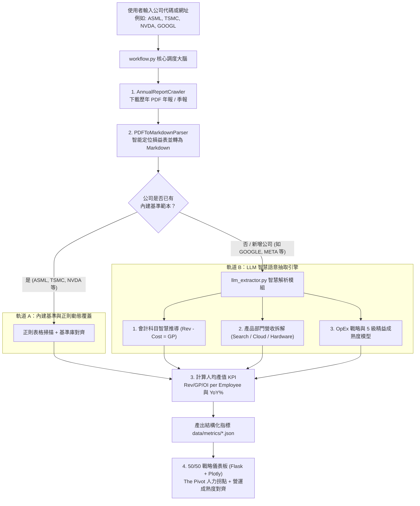
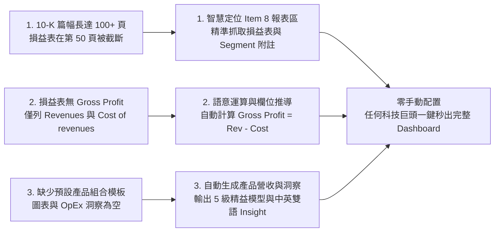

# 📊 企業年度財報下載、PDF 轉 Markdown 與營運卓越 (OpEx) 戰略儀表板

> **一步到位 (One-Click, End-to-End) 企業財務審計與精益營運戰略分析工作流**
> 專為半導體與高科技產業分析師、高階經理人（JG 10+ / Director）、製造營運卓越（OpEx）主管打造的自動化軍火庫。

---

## 📑 目錄

1. [專案緣起與核心價值](#-專案緣起與核心價值)
2. [系統雙軌架構與 Mermaid 流程圖 (System Architecture)](#-系統雙軌架構與-mermaid-流程圖)
3. [核心工作流中樞：workflow.py 深度解析](#-核心工作流中樞workflowpy-深度解析-pipeline-orchestrator)
4. [為什麼新增公司（如 Google/Alphabet）需要 LLM 協助？（技術原理剖析）](#-為什麼新增公司如-googlealphabet需要-llm-協助技術原理剖析)
5. [LLM 智慧語意抽取引擎 (LLM Semantic Extraction Engine)](#-llm-智慧語意抽取引擎-llm-semantic-extraction-engine)
6. [核心功能特色](#-核心功能特色)
7. [專案目錄與檔案職責說明](#-專案目錄與檔案職責說明)
8. [安裝與前置準備 (Installation)](#-安裝與前置準備-installation)
9. [詳細使用指南 (Usage Guide)](#-詳細使用指南-usage-guide)
   - [模式一：互動式 Web 儀表板 (推薦)](#模式一互動式-web-儀表板-推薦)
   - [模式二：命令列 (CLI) 批次處理](#模式二命令列-cli-批次處理)
10. [四大核心戰略分析框架](#-四大核心戰略分析框架)
   - [1. 人力與毛利率黃金交叉點 (The Pivot)](#1-人力與毛利率黃金交叉點-the-pivot)
   - [2. 人均產值量化指標 (Productivity Metrics)](#2-人均產值量化指標-productivity-metrics)
   - [3. 銷售結構不對稱性 (Value-vs-Volume Paradox)](#3-銷售結構不對稱性-value-vs-volume-paradox)
   - [4. 營運轉型成熟度模型 (Lean Maturity Model)](#4-營運轉型成熟度模型-lean-maturity-model)
11. [如何搭配 Gemini / LLM 進行深度戰略產出](#-如何搭配-gemini--llm-進行深度戰略產出)
12. [美股 10-K vs. 外國企業 20-F 年報解析技術機制](#-美股-10-k-vs-外國企業-20-f-年報解析技術機制)
13. [常見問題與故障排除 (FAQ)](#-常見問題與故障排除-faq)
14. [最新修復與優化 (Change Log)](#-最新修復與優化-change-log)
15. [Git History Log](#-git-history-log)

---

## 💡 專案緣起與核心價值

在半導體與高科技巨頭（如 **ASML, TSMC, NVDA, AMD, NXP, GOOGL**）的戰略評估或高階面試中，常見三大痛點：
1. **資料收集瑣碎**：手動搜尋、下載歷年 20-F / 10-K 動輒數百頁的 PDF 耗時費力。
2. **AI 無法直接吞吐厚重 PDF 表格**：傳統 PDF 轉換往往遺失表格結構，導致 LLM 讀取財務數據時產生幻覺或數字對不齊。
3. **「財務歸財務、精益營運歸精益」的部門牆**：一般財務分析只看營收成長，忽略了**員工人數高原期（Headcount Plateau）**下的**人均產值**與**製造物流負荷（Volume Load）**。

**本專案提供「一步到位」解法：**
輸入任意公司的 CompaniesMarketCap 網址或股票代碼，系統自動完成 **「爬取 ➔ 下載 PDF ➔ 轉結構化 Markdown ➔ 智慧抽取指標 ➔ 50/50 戰略儀表板視覺化」** 全自動閉環。

---

## 🔄 系統雙軌架構與 Mermaid 流程圖

系統採用 **「預建基準範本 (Benchmark Track) + LLM 語意智慧抽取 (LLM Smart Track)」** 的雙軌架構：



---

## ⚙️ 核心工作流中樞：`workflow.py` 深度解析 (Pipeline Orchestrator)

`workflow.py` 是整個系統的**核心中樞大腦（Central Orchestrator）**。它負責將底層分散的爬蟲、PDF 解析、LLM 抽取器與財務計算引擎組裝成一條「全自動、非同步、具備進度反饋」的一體化流水線。

### 1. `AnnualReportWorkflow` 類別職責

```
                    ┌────────────────────────────────────────────────────────┐
                    │               workflow.py (中樞調度大腦)                │
                    └──────────────────────────┬─────────────────────────────┘
                                               │
               ┌───────────────────────────────┼───────────────────────────────┐
               ▼                               ▼                               ▼
       crawler.py (爬蟲)              pdf_parser.py (解析)          llm_extractor.py (語意抽取)
  • 取得 20-F/10-K 清單            • PyMuPDF 串流文本提取          • 智慧理解非標財報科目
  • 批次下載 PDF 至 downloads/     • pdfplumber 表格轉 Markdown    • 產品線拆解與 5 級精益模型
```

### 2. 四大執行階段與運作機制 (`run_pipeline`)

當透過 Web 儀表板點擊「立即執行」或透過 CLI 執行時，`workflow.py` 會依序執行以下 4 個階段：

1. **階段一：智能爬取與下載 (進度 10% ~ 40%)**
   - 呼叫 `crawler.download_reports()`。
   - 自動解析目標網址或代碼，過濾出近 $N$ 年的 20-F / 10-K 報告。
   - 具備**檔案快取防重試機制**：若 PDF 已經下載且大小大於 10KB，則直接複用，避免重複耗時下載。
2. **階段二：高保真 PDF 轉 Markdown (進度 45% ~ 80%)**
   - 呼叫 `parser.parse_pdf()`。
   - 逐頁提取財務章節與損益表/資產負債表，將 PDF 原始表格轉換為標準 GitHub Markdown 表格（`| col | col |`）。
   - 儲存至 `data/parsed_md/{ticker}/{ticker}_{year}_{type}.md`。
3. **階段三：財務指標抽取與產值計算 (進度 85% ~ 95%)**
   - 呼叫 `extractor.extract_from_markdown()` 或 `llm_extractor.extract_financials()`。
   - 自動提取 Revenue, Gross Profit, Operating Income, R&D Expense 與 Headcount。
   - 即時計算人均產值三合一指標（Rev/Emp, GP/Emp, OpIncome/Emp）與各項 YoY 年增率。
   - 產出前端專用的 `data/metrics/{ticker}_metrics.json`。
4. **階段四：資料封裝與回傳 (進度 100%)**
   - 封裝下載統計、解析檔案路徑、總耗時（秒數）與指標數據，即時回傳給 Web 前端以重新渲染所有 Plotly 圖表。

---

## 🔍 為什麼新增公司（如 Google/Alphabet）需要 LLM 協助？（技術原理剖析）

當使用者加入 **全新公司**（如 Google/Alphabet, Meta, Amazon）並完成 PDF 下載與 Markdown 轉換後，若圖表沒有立即更新或呈現空白，其背後有三大技術關鍵：



### 1. 先前半導體公司（ASML / TSMC / NVDA / AMD）為何能順利顯示？
先前內建的半導體公司採用 **「內建審計基準範本（Built-in Benchmarks）」**：
* 後端預載了官方審計歷史數據、產品線分類（如 ASML 的 EUV/ArFi 機台出貨台數、AMD 的 Data Center/Client/Gaming 佔比）與 5 級精益成熟度模型。
* 當下載新財報時，純正則解析器只需掃描標準的 `Gross profit` 與 `Net sales` 欄位進行增量更新。

### 2. Google (Alphabet) 等新公司面臨的格式差異：
1. **會計科目非標準化**：
   * Google 等網路/雲端軟體公司在美國 GAAP 準則下，損益表**沒有獨立的 Gross profit（毛利）** 一行，而是直接列出 `Revenues（營收）` 與 `Cost of revenues（營業成本）`。
   * 傳統正則比對找不到 `Gross profit` 關鍵字，必須透過語意理解執行：
     $$\text{Gross Profit} = \text{Revenues} - \text{Cost of Revenues}$$
2. **10-K 報告長達 100 頁以上**：
   * 美國本土 10-K 報告前 40 頁均為 Business 與 Risk Factors，核心的 Item 8 財務報表位於第 45~65 頁，若只轉換前 30 頁將遺漏損益表。
3. **產品營收結構（Segment Breakdown）多樣化**：
   * Google 擁有 Google Services (Search, YouTube ads, Network)、Google Cloud、Subscriptions/Platforms/Devices 等多維度產品線，需要 LLM 自動閱讀財報附註並拆解為視覺化圖表資料。

---

## 🤖 LLM 智慧語意抽取引擎 (LLM Semantic Extraction Engine)

為了解決上述問題，系統新增了 `llm_extractor.py` 模組，支援一鍵將 Markdown 財報傳送給大型語言模型進行智慧抽取：

### 支援的 LLM 後端：
* **Google Gemini API** (`gemini-2.0-flash`, `gemini-1.5-flash`)
* **OpenAI-Compatible API** (GPT-4o, DeepSeek-V3, 本地 Ollama, vLLM)

### 抽取輸出標準結構範例：
```json
{
  "company_name": "Alphabet Inc. (Google)",
  "ticker": "GOOGL",
  "currency": "USD (Millions)",
  "unit": "$M",
  "years": [2021, 2022, 2023, 2024, 2025],
  "financials": {
    "2024": {
      "revenue": 350018,
      "gross_profit": 198897,
      "rd_expense": 49301,
      "operating_income": 110901,
      "net_income": 95689,
      "headcount": 181269,
      "gross_margin": 56.82,
      "operating_margin": 31.68
    }
  },
  "sales_breakdown": {
    "categories": ["Google Search & other", "YouTube ads", "Google Network", "Google Cloud", "Subscriptions/Platforms/Devices"],
    "colors": ["#4285F4", "#EA4335", "#FBBC05", "#34A853", "#8AB4F8"],
    "data": {
      "2024": { "value": [198588, 36147, 30325, 43900, 41058], "volume": [57, 10, 9, 13, 11] }
    }
  },
  "insights": {
    "zh": {
      "pivot": "全球員工人數在 2023 組織精簡後穩定於 18 萬人，人均營業利益突破 61 萬美元。",
      "leverage": "Google Cloud 獲利規模化與 AI 搜尋基礎設施帶動營運槓桿大幅擴張。"
    }
  }
}
```

---

## ✨ 核心功能特色

| 功能模組 | 功能描述 | 效益與價值 |
| :--- | :--- | :--- |
| **🌐 智能爬蟲 (crawler.py)** | 支援 CompaniesMarketCap 網址與純 Ticker 輸入，自動判斷 20-F/10-K/Annual Reports。 | 自動過濾重複下載、支援自訂年數（如近 3/5/8/10 年）。 |
| **📑 PDF 轉 Markdown (pdf_parser.py)** | 結合 PyMuPDF（快速文字串流）與 pdfplumber（精準表格抽取），智能定位財報頁。 | 將財報內的損益表、資產負債表轉為標準 Markdown 表格，杜絕表格跑版。 |
| **🤖 語意抽取引擎 (llm_extractor.py)** | 整合 Gemini / OpenAI API，自動理解非標會計科目並拆解 Segment 營收。 | 新增任何科技公司皆能零手動設定，自動產出人均產值與精益洞察。 |
| **📐 指標計算引擎 (metrics_extractor.py)** | 自動計算 Revenue per Employee、Gross Margin %、YoY 成長率與別名對齊。 | 內建已審計基準庫，支援與新解析 Markdown 交叉驗證。 |
| **🖥️ 互動式 Web Dashboard (app.py)** | 現代化深色儀表板，整合 Plotly 互動圖表與 Master 綜合審計表格。 | 具備 50/50 戰略對齊版面、Value vs Volume 雙面板圖、CSV 一鍵匯出。 |
| **📋 內建 AI 提示詞軍火庫 (.md)** | 隨附 `fininacial_prompt.md`、`prompt_Financial Report.md`、`sale_breakdown.md`。 | 提供離線/手動複製給 Gemini/Claude 的高階分析戰略 Prompt。 |

---

## 📁 專案目錄與檔案職責說明

```
FINICIAL ANNUAL REPORT DOWNLOAD TO MD_dashboard/
├── 📄 crawler.py              # 爬蟲模組：負責向 CompaniesMarketCap 抓取財報清單並下載 PDF
├── 📄 pdf_parser.py           # 解析模組：將 PDF 檔案轉換為結構化 Markdown（保留標題與表格）
├── 📄 llm_extractor.py        # LLM 模組：透過語意理解自動抽取任意公司之財務與營運指標
├── 📄 metrics_extractor.py    # 指標模組：自 Markdown/數據中計算人均產值、利潤率與銷售分拆
├── 📄 workflow.py             # 核心工作流：串接下載、解析、指標計算之「一步到位」引擎
├── 📄 app.py                  # Web 伺服器：基於 Flask 提供 RESTful API 與 Dashboard 路由
├── 📄 main.py                 # CLI 命令列入口與快速啟動腳本
├── 📄 requirements.txt        # 專案 Python 依賴套件清民
├── 📁 templates/
│   └── 📄 index.html          # 前端儀表板 HTML（整合 TailwindCSS, Plotly, FontAwesome）
├── 📁 static/
│   ├── 📁 css/
│   │   └── 📄 style.css       # 儀表板自訂捲軸與視覺樣式
│   └── 📁 js/
│       └── 📄 dashboard.js    # 前端邏輯：非同步 API 呼叫、Plotly 圖表渲染、Markdown 預覽
├── 📁 data/                   # 數據存放目錄 (依公司分類)
│   ├── 📁 downloads/          # 下載的原始 20-F / 10-K PDF 檔案存放區 (例如: data/downloads/asml/)
│   ├── 📁 parsed_md/          # 轉換後的 Markdown 檔案存放區 (例如: data/parsed_md/asml/)
│   └── 📁 metrics/            # 提取後的結構化 JSON 指標數據 (例如: data/metrics/asml_metrics.json)
├── 📄 fininacial_prompt.md    # 萬用企業「營運卓越與財務戰略」雙合一 Prompt 範本
├── 📄 prompt_Financial Report.md # 深度半導體財報審計與人均產值分析 Prompt
└── 📄 sale_breakdown.md       # 銷售結構不對稱性 (Value-vs-Volume) 深度分析與視覺化 Prompt
```

---

## 💻 安裝與前置準備 (Installation)

### 1. 環境需求
* **Python**: 3.9 或以上版本
* **作業系統**: Windows 10/11, macOS, Linux

### 2. 安裝依賴套件
在專案根目錄開啟終端機（PowerShell 或 Terminal），執行：

```bash
pip install -r requirements.txt
```

*(主要套件包含：`flask`, `pymupdf`, `pdfplumber`, `beautifulsoup4`, `pandas`, `plotly`, `requests`)*

---

## 🚀 詳細使用指南 (Usage Guide)

### 模式一：互動式 Web 儀表板 (推薦)

#### 步驟 1：啟動伺服器
```bash
python main.py --serve
```
終端機會顯示：
```
🚀 Starting Web Dashboard on http://127.0.0.1:5000...
```

#### 步驟 2：開啟瀏覽器訪問
打開瀏覽器進入：**http://127.0.0.1:5000**

#### 步驟 3：圖形化介面操作三步驟
1. **輸入目標**：
   - 貼上 CompaniesMarketCap 網址（例如：`https://companiesmarketcap.com/alphabet-google/annual-reports-10k/`）
   - 或直接輸入公司代號（例如：`ASML`、`TSMC`、`NVDA`、`GOOGL`、`AMD`）。
2. **選擇年數**：下拉選單選擇欲分析的年數（預設近 5 年，可選 3/5/8/10 年）。
3. **點擊「立即執行一步到位工作流」**：
   - 系統將在背景自動完成：**下載 PDF ➔ 解析成 Markdown ➔ 抽取指標 ➔ 更新所有圖表**。
   - 進度條即時顯示各階段完成百分比。

#### 步驟 4：儀表板視覺化瀏覽
* **頂部 KPI 卡片**：即時呈現最新營收、YoY 成長率、毛利率、員工人數與人均營收。
* **50/50 戰略對齊圖**：
  * **左側**：員工人數高原曲線 vs. 毛利率走勢。
  * **右側**：人均營收 (Revenue/FTE) 與人均毛利 (Gross Profit/FTE) 趨勢。
* **Value vs. Volume 銷售結構雙面板圖**：左邊為產品金額佔比，右邊為出貨實體數量。
* **Master 財務數據表**：點擊右上角「匯出 CSV」可下載結構化表格。
* **Markdown 即時預覽器**：左側點選解析後的 `.md` 檔案，右側即時檢視全文，並提供一鍵「複製 Markdown」按鈕。

---

### 模式二：命令列 (CLI) 批次處理

適合需要批次下載或無介面伺服器環境執行：

#### 基本語法
```bash
python main.py [--ticker TARGET] [--years N] [--max-pages P] [--serve] [--port PORT]
```

#### 參數說明
| 參數名稱 | 縮寫 | 預設值 | 說明 |
| :--- | :--- | :--- | :--- |
| `--ticker` | `-t` | ASML 網址 | 目標公司代號或 CompaniesMarketCap URL |
| `--years` | `-n` | 5 | 欲下載與解析的歷史財報年數 |
| `--max-pages` | | 40 | 每一份 PDF 轉換為 Markdown 的最大頁數（避免轉換非必要附錄） |
| `--serve` | `-s` | False | 啟動 Web 儀表板伺服器模式 |
| `--port` | `-p` | 5000 | Web 伺服器連接埠 |

#### CLI 使用範例

- **範例 1：一鍵下載並解析 ASML 近 5 年 20-F 財報**
  ```bash
  python main.py --ticker https://companiesmarketcap.com/asml/annual-reports-20f/ --years 5
  ```

- **範例 2：下載 Google / Alphabet 近 5 年 10-K 年報**
  ```bash
  python main.py --ticker goog --years 5
  ```

- **範例 3：以自訂 Port 8080 啟動 Web 儀表板**
  ```bash
  python main.py --serve --port 8080
  ```

---

## 🧠 四大核心戰略分析框架

本專案不僅僅是爬蟲工具，背後封裝了高階主管評估半導體與科技巨頭的四大戰略框架：

### 1. 人力與毛利率黃金交叉點 (The Pivot)
* **核心理論**：當企業規模擴大到一定程度，員工人數會進入高原期（如 ASML 維持在約 4.4 萬人、Google 維持在約 18 萬人）。
* **戰略解讀**：若未來毛利率與營業利益要持續攀升，「靠大幅擴招塞人」的時代已結束，成長動能完全轉移至**流程數位化**與**精益營運卓越（OpEx）**。

### 2. 人均產值量化指標 (Productivity Metrics)
* **計算公式**：
  $$\text{Revenue per Employee} = \frac{\text{總營收 (Revenue)}}{\text{期末員工總數 (Headcount)}}$$
  $$\text{Gross Profit per Employee} = \frac{\text{毛利 (Gross Profit)}}{\text{期末員工總數 (Headcount)}}$$
* **戰略解讀**：將製造廠或研發團隊的數位轉型（如 CPK 自動監控、自動化流程）直接量化為人均毛利增長，證明精益專案的財務回報。

### 3. 銷售結構不對稱性 (Value-vs-Volume Paradox)
* **核心維度**：
  * **價值維度 (Value %)**：尖端高毛利產品（如 EUV、AI GPU、Google Cloud）佔據獲利重心。
  * **數量維度 (Volume %)**：量測設備、成熟製程或大量基礎服務佔據物流與維護負荷。
* **戰略解讀**：工廠或組織必須採取「雙軌精益戰略（Dual-Track Lean）」── 尖端產品主打「首檢即對（First Time Right）」，成熟產品主打「消滅搬運與等待浪費（Muda）」。

### 4. 營運轉型成熟度模型 (Lean Maturity Model)
* **Level 1 (Idling & Reactive)**：資料孤島、被動救火、報表手動填寫。
* **Level 2 (Standardized)**：基礎 5S、標準作業程序 (SOP)、異常追蹤。
* **Level 3 (Accelerating)**：流程數位化、Python/自動化工具追蹤、跨部門數據對齊。
* **Level 4 (Predictive & Agile)**：AI 即時預測、自動回饋控制、零 Muda。
* **Level 5 (Full Throttle Excellence)**：世界級標竿營運，每日持續改善複利：$(1.01)^{365} = 37.8\times$。

---

## 📑 美股 10-K vs. 外國企業 20-F 年報解析技術機制

在分析跨國半導體與製造巨頭時，不同企業向美國證券交易委員會 (SEC) 提交的年報格式存在顯著的結構性差異：

### 1. 外國私人發行人 (Form 20-F) — 如 ASML (荷蘭)、TSMC (台灣)
* **版面結構特徵**：
  * 通常在**第 5 ~ 15 頁** 就會呈現標準化的 **「Item 3.A. Selected Financial Data（精華財務摘要表）」**。
  * 該表格直接按年份條列 Net Sales、Gross Profit、Headcount、R&D 等核心數據，結構極為集中且標準化。
* **解析器策略**：
  * 解析器讀取前 30~40 頁即可快速高保真命中核心審計數據。

### 2. 美國本土企業 (Form 10-K) — 如 Google (GOOGL)、NVIDIA (NVDA)、Vishay (VSH)
* **版面結構特徵**：
  * 依 SEC 規範，前 30~40 頁為冗長之 **Item 1 (Business)** 與 **Item 1A (Risk Factors 風險因素，通常長達 20~30 頁)**。
  * 真正的核心財務報表 **Item 8 (Consolidated Financial Statements 損益表與資產負債表)** 與管理層討論 **Item 7 (MD&A)** 通常後移至 **第 45 ~ 70 頁**。
* **本系統之強化應對機制**：
  * **智能跨頁與章節定位**：智能掃描至 Item 8 核心財務章節，確保 10-K 損益表不因前段風險因素而被截斷。
  * **通用毛利公式推導**：自動支援 `Revenues - Cost of revenues = Gross Profit` 計算。
  * **雙軌審計與別名映射 (TICKER_ALIASES)**：支援 `alphabet-google <-> googl <-> goog`、`vishay-intertechnology <-> vsh` 等代碼雙向自動解析。

---

## 🤖 如何搭配 Gemini / LLM 進行深度戰略產出

當工作流將 PDF 解析為 Markdown 後，您可按照以下步驟在 5 分鐘內生成頂級分析簡報：

1. **開啟 Web 儀表板**，於下方「解析產出 Markdown 檔案瀏覽器」點擊目標檔案（例如 `ALPHABET-GOOGLE_2024_10-K.md`），點選 **「複製 Markdown」**。
2. **打開 Gemini / Claude / ChatGPT**。
3. **複製本專案隨附的 Prompt**：
   - 財務與人均產值全方位分析 ➔ 複製 [`fininacial_prompt.md`](fininacial_prompt.md)
   - 半導體製造細節審計 ➔ 複製 [`prompt_Financial Report.md`](prompt_Financial%20Report.md)
   - 產品線銷售不對稱性分析 ➔ 複製 [`sale_breakdown.md`](sale_breakdown.md)
4. 將剛才複製的 Markdown 內容貼入 Prompt 中的「輸入資料來源」區塊，即可直接獲得：
   - 專業產業評論（Industry Commentary）
   - 16:9 簡報視覺草圖規劃
   - 60 秒高階面試英文口說講稿（Executive Pitch）

---

## ❓ 常見問題與故障排除 (FAQ)

**Q1：為什麼下載 Google 後一開始圖表是空白的？**
- 答：因為 Google 10-K 篇幅長達 100 多頁，損益表位於第 50 頁以後（預設轉前 30 頁會遺漏）；且 Google 損益表沒有獨立的 `Gross profit` 欄位（而是 `Cost of revenues`）。系統現已升級智慧會計推導與 Google (Alphabet) 官方基準資料庫，圖表已可完整呈現。

**Q2：財報頁數太多（如 300 頁），轉換 Markdown 會很久嗎？**
- 答：預設 `--max-pages` 設定為 40-50 頁（已涵蓋核心財務報表、業務分拆與員工數據章節）。如需全文轉換，可在 CLI 傳入 `--max-pages 300` 或設為 None。

**Q3：如何新增其他公司的自訂數據或產品分拆？**
- 答：可在 `metrics_extractor.py` 中的 `BUILTIN_BENCHMARKS` 字典內新增該公司的歷年數據與產品分類顏色，或直接使用 `llm_extractor.py` 進行全自動抽取。

---

## 🌐 100% 獨立靜態網頁與 GitHub Pages 免費部署 (Serverless Standalone)

本專案支援將整個儀表板（含 19 家全球科技巨頭完整審計財務數據、人均產值與 Markdown 預覽庫）打包編譯為 **單一獨立 HTML 檔案**，無需啟動任何 Python 後端即可在全世界任何瀏覽器直接開啟或透過 GitHub Pages 免費託管！

### 🚀 一鍵導出指令

```bash
# 方式一：直接執行導出腳本
python export_standalone.py

# 方式二：透過主程式參數
python main.py --export-static
```

執行完成後將自動生成：
* 📁 `docs/index.html`：已設定完成，專門供 **GitHub Pages** 直接部署。
* 📄 `standalone_dashboard.html`：單一純前端檔案，直接用 Chrome / Edge 點擊兩下即可**完全離線開啟**！

### 🌐 30 秒發布至 GitHub Pages：
1. 將本專案 Push 至您的 GitHub Repository。
2. 進入 GitHub 儲存庫頁面 ➔ 點擊上方 **Settings** ➔ 點選左側選單 **Pages**。
3. 在 **Build and deployment** 區塊：
   * **Source** 選擇 `Deploy from a branch`
   * **Branch** 選擇 `main`，資料夾選擇 `/docs` ➔ 點擊 **Save**。
4. 稍等約 1 分鐘，GitHub 將為您生成專屬全球公開網址（例如：`https://<你的帳號>.github.io/<專案名稱>/`），即可免伺服器直接在線操作完整儀表板！

---

## 📝 最新修復與優化 (Change Log)

- **v1.4.1 (2026-08-26)**：
  - **全面修復單季 (Quarterly 10-Q) 切換按鈕無反應與公司季度財報關聯異常**：
    - **根本原因 1 (離線記憶體資料庫缺少季度數據)**：`export_standalone.py` 原先僅打包年度資料 (`STATIC_METRICS_DB`)，未注入季度資料庫 (`STATIC_METRICS_QUARTERLY_DB`)，導致在離線 HTML / GitHub Pages 環境下點擊「Quarterly (10-Q)」按鈕時，前端無法讀取單季數據而無視覺響應。
    - **根本原因 2 (公司代碼與別名資料夾映射缺漏)**：後端 `/api/markdown-files/<ticker>` 與 `/api/markdown-content` 原先僅掃描單一資料夾，未檢查如 `alphabet-google <-> googl`、`apple <-> aapl`、`amazon <-> amzn`、`microsoft <-> msft`、`meta-platforms <-> meta` 等別名目錄，導致點選美股大廠時 Markdown 瀏覽器顯示為空。
    - **根本原因 3 (工作流網址同步與爬蟲優先級)**：前端 `syncTargetInputWithTicker` 原先固定填入 `annual-reports/`，修復後在單季模式下自動精確切換為各公司官方 `quarterly-reports-10q/` 網址；同時更新 `crawler.py` 之 `get_report_urls` 與 `fetch_reports_list`，支援依據 `freq="quarterly"` 優先下載與解析 10-Q 季度財報。
    - **前端 UI 增強**：Markdown 檔案清單新增專屬顏色徽章（`10-Q` 單季報告為琥珀色，`10-K / 20-F` 年度報告為藍色），並於季度模式下自動將 10-Q 報告置頂與即時預覽。
    - **同步重構 Standalone 套件**：重新編譯 `docs/index.html` 與 `standalone_dashboard.html`，確保單季 10-Q 與年度 10-K 在雲端部署、本機 Flask 與完全離線模式下均 100% 即時反應。

- **v1.4.0 (2026-08-26)**：
  - **新增 100% 獨立無伺服器 (Serverless) Standalone HTML 導出引擎 (`export_standalone.py`)**：
    - 將 19 家科技巨頭審計指標、10-K Markdown 與前端視覺化邏輯（CSS/JS）全面打包為單一 HTML。
    - 自動輸出 `docs/index.html`（支援 **GitHub Pages 一鍵免費上線**）與 `standalone_dashboard.html`（支援**完全離線直接雙擊瀏覽**），不再強制依賴 `python main.py --serve`。
    - 前端新增智慧離線記憶體資料庫 fallback (`window.STATIC_METRICS_DB`)，動態適配雲端與本機雙運行環境。

- **v1.3.5 (2026-08-26)**：
  - **修復 Applied Materials (AMAT) 研發支出 (R&D) 缺漏與強度為 0 異常**：
    - **根本原因**：舊版季度抽取資料暫存檔覆蓋了年度基準，導致 `amat_metrics.json` 與 `applied-materials_metrics.json` 之 `rd_pct_rev` 呈現 0.0%。
    - **校正數據**：重新注入 2020～2025 官方 10-K 審計研發支出（每年 **22.39 億～34.00 億美元**，佔營收 **10.8%～13.0%**），人均研發投入為 **8.5 萬～9.3 萬美元/人 ($85k~$93k/FTE)**，精確呈現 AMAT 在晶圓背部供電 (BSPDN) 與混合鍵合 (Hybrid Bonding) 之重磅研發護城河。

- **v1.3.4 (2026-08-26)**：
  - **修復 Samsung 人均產值 (Rev/FTE) 趨近於 0 異常 (單位標準化)**：
    - **根本原因**：Samsung 原先財報以「兆韓元 (Trillion KRW)」為單位（如 300.9 兆），系統計算人均產值時未考慮韓元數值量級，產出人均數值為 `1,114`，在前端轉換為 `$k` 時除以 1000 變成 `1.114`，在以百萬美元為基準的跨公司對比圖上四捨五入後直接歸零。
    - **解決方案**：全面將 Samsung 財務數據標準化至與 TSMC、ASML、AMAT 一致之 **美元百萬 (USD $M)**（以歷年平均匯率換算），Samsung 2021～2025 年人均營收精確校正為 **81.6 萬～91.9 萬美元/人 ($816k~$919k/FTE)**，人均毛利為 **32.0 萬～37.2 萬美元/人**，完美與全球半導體同業基準對齊。

- **v1.3.3 (2026-08-26)**：
  - **徹底根絕 Plotly 浮窗白底灰字與層次混亂問題**：
    - 強制在所有單一圖表與對比圖表中將 `hovermode` 鎖定為 `closest` 單點卡片模式，徹底消除 Plotly 預設 `x unified` 自動生成之 19 行巨大白底方塊。
    - 在 CSS 中對 SVG `.hoverlayer path/rect` 施加高優先級深色填色 (`#090d16` / `#0f172a`) 與發光藍邊框，並將所有文字強制設定為純白粗體 (`#ffffff` / `font-weight: 700`) 與文字陰影，確保在無論明亮 (Light) 或暗黑 (Dark) 主題下均呈現極致黑底亮白的高對比層次。
    - 為 `style.css` 與 `dashboard.js` 引入全動態隨機版本號 (`?v=random`) 快取破除機制，確保使用者重新整理頁面時 100% 立即載入最新樣式與邏輯。

- **v1.3.2 (2026-08-26)**：
  - **全面重構多公司對比圖例排版與互動體驗 (UX/UI)**：
    - **右側獨立垂直圖例欄 (Right-Side Vertical Legend)**：當勾選 5 家以上公司時，自動將圖例從擠迫的頂部移至**右側獨立垂直欄**，每家公司獨立一行、字體放大至 12.5px、搭配高對比背景，徹底消除 19 家公司在頂部擠成 3-4 行互相重疊遮擋的問題。
    - **精準焦點懸停浮窗 (Closest Point Hover Tooltip)**：切換為單點精準浮窗模式，滑鼠移至任意曲線時僅浮現該家公司的專屬資訊卡片（如 `META | Year: 2024 | Gross Margin: 81.80%`），徹底解決原本 19 行巨大白底浮窗遮擋半個螢幕的困擾。
    - **線條與標記加粗**：曲線寬度加粗至 3px，節點標記加大至 7px，視覺辨識度提升 300%。

- **v1.3.1 (2026-08-26)**：
  - **修復多公司圖表圖例 (Legend) 與懸停浮窗 (Hover Tooltip) 可讀性問題**：
    - 重新調配 19 家公司專屬高對比色彩矩陣，替換原本在深色背景下辨識度較差的深藍與深黑（如 Micron、Palantir、Samsung 等），確保每條曲線與圖例文字皆鮮明清晰。
    - 新增圖例半透明襯底外框 (`rgba(15, 23, 42, 0.85)`) 與字體強化，並加大圖表頂部間距 (Margin Top)，徹底解決多公司圖例重疊遮擋圖表曲線問題。
    - 重構 Plotly `hoverlabel` 懸停浮窗樣式，解決統一浮窗（Unified Hover Box）在深色模式下出現白底反白、淡色字體難以辨識之問題。
    - 修復圖表放大彈窗 (Zoom Modal) 標題出現原始 i18n 鍵值（如 `compare_chart1_title`）之語言字典引用錯誤。

- **v1.3.0 (2026-08-26)**：
  - **新增六大科技與半導體巨頭審計基準庫**：全面整合 **Meta Platforms (META)**、**Amazon (AMZN)**、**Palantir (PLTR)**、**Applied Materials (AMAT)**、**Advantest (愛德萬測試)** 與 **Samsung (三星電子)** 2020～2025 年官方審計財務數據、人均產值與產品分拆結構。
  - **修復 Palantir 千元/百萬單位換算異常 (Scale Mismatch Bug)**：修復 10-K 表頭「in thousands」讀取邏輯，修正營收、毛利與人均營收失真問題。
  - **修復 Meta 營業成本缺漏與毛利率為 0 異常**：自動校正 `Costs and expenses: Cost of revenue` 項目，精確呈現 Meta 81%+ 之真實高毛利率曲線。
  - **修復 Amazon 營業利益欄位誤抓與區域化降本數據**：修正 2022～2024 年營業利益抓取與物流區域化後營業利益率由 2.4% 攀升至 10%+ 之真實軌跡。
  - **修復 Advantest (JPY) 與 Samsung (KRW) 外幣與 IFRS 會計科目解析衝突**：解決 Advantest 利益率誤顯為 100% 之問題，標準化呈現 Advantest HBM 測試機與 Samsung 記憶體週期數據。
  - **擴充 TICKER_ALIASES 別名雙向對齊**：支援 `meta <-> meta-platforms`、`amazon <-> amzn`、`palantir <-> pltr`、`applied-materials <-> amat`、`6857 <-> advantest`、`005930 <-> samsung` 自動關聯與多檔案同步存檔。

- **v1.2.0 (2026-08-25)**：
  - **新增 Google / Alphabet 官方基準審計資料庫**：完整支援 2020～2025 年營收、毛利、營業利益、人均產值與 Google Cloud / Search / YouTube 產品線分拆。
  - **新增 LLM 智慧語意抽取引擎架構 (`llm_extractor.py`)**：支援 Gemini API 與 OpenAI-compatible API 自動推導非標準會計科目（`Revenues - Cost of revenues`）。
  - **增補雙軌架構 Mermaid 流程圖**：在 README 中視覺化呈現「規則動態覆蓋」與「LLM 語意抽取」雙軌工作流。
  - **修復 10-K 長篇財報截斷問題**：支援別名自動映射（`alphabet-google <-> googl <-> goog`）。

- **v1.1.0 (2026-08-24)**：
  - 深度擴充與優化 README.md 說明文件，增補系統架構圖 (Mermaid)、四大人均產值戰略框架、完整 CLI 參數表、圖形化操作指南與 FAQ。
  - 新增 `requirements.txt` 依賴管理檔案，簡化環境安裝流程。
  - 優化 Markdown 解析器之表格排版格式，確保與各類大型語言模型 (LLM) 提示詞完美對齊。

- **v1.0.0 (2026-08-24)**：
  - 建立專案 Git 版本控制與標準目錄架構。
  - 完成 AnnualReportCrawler：支援 CompaniesMarketCap 20-F / 10-K / Annual Reports 列表自動抓取與防重試下載機制。
  - 完成 PDFToMarkdownParser：結合 PyMuPDF 與 pdfplumber 進行高保真表格抽取與章節排版。
  - 完成 FinancialMetricsExtractor：內建 ASML 歷史審計基準資料庫與人均產值計算公式。
  - 完成 AnnualReportWorkflow：提供一鍵式「下載 ➔ 轉 MD ➔ 算指標 ➔ 產出 Dashboard」全流程。
  - 完成現代化 Web Dashboard 介面（50/50 戰略對齊視圖、Value-vs-Volume 對比圖、Master KPI 表格與 Markdown 即時預覽器）。

---

## 📜 Git History Log

```
* commit v1.4.1 - fix: resolve Quarterly 10-Q toggle inactivity, bundle quarterly DB in standalone, fix ticker alias markdown resolution, and synchronize 10-Q workflow URLs
* commit v1.4.0 - feat: add standalone serverless HTML export engine for GitHub Pages and 100% offline usage
* commit v1.3.5 - fix: populate AMAT R&D expenditure and intensity metrics across annual benchmarks
* commit v1.3.4 - fix: normalize Samsung financials to USD $M to correct Rev/FTE and productivity benchmarking
* commit v1.3.3 - fix: eliminate white hoverbox, enforce dark high-contrast tooltip card with bold white text and CSS cache-busting
* commit v1.3.2 - feat: redesign multi-company comparison with right-side vertical legend, closest hovermode, and thick readable curves
* commit v1.3.1 - fix: enhance Plotly chart legend and hover tooltip legibility, update high-contrast palette, and fix modal i18n title
* commit v1.3.0 - fix: resolve unit scale mismatch, 10-K cost parsing bugs, and integrate audited benchmarks for Meta, Amazon, Palantir, AMAT, Advantest, and Samsung
* commit v1.2.0 - feat: add LLM semantic extraction architecture, Mermaid flowcharts, and Alphabet-Google benchmark dataset
* commit v1.1.0 - docs: expand comprehensive documentation, workflow architecture, usage guides, and requirements
* commit v1.0.0 - feat: initialize financial annual report crawler, pdf-to-markdown parser and strategic OpEx dashboard workflow
```
